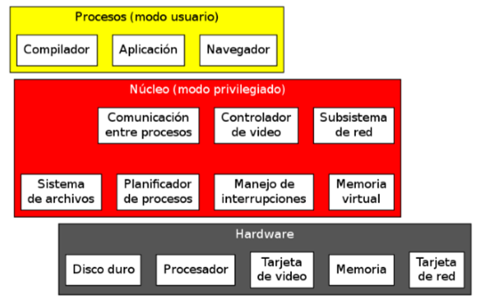
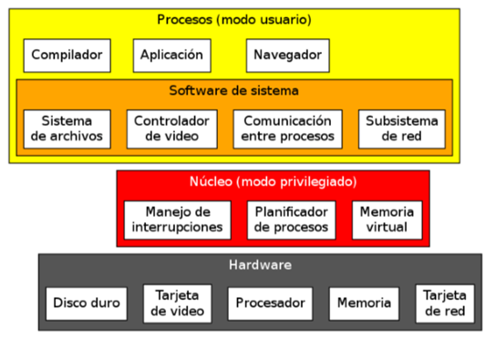

# 📘 Introducción

> Material de cursada de la materia **Sistemas Operativos**  
> 📅 Inicio: 09/04/2025  
> 🎓 Alumno: Tiago Pujia | 👨‍🏫 Prof: Alexis Villamayor  
> 🕔 Comisión 3900 [3 = Miercoles, 9 = Turno noche]
> ▶️ [Clases Grabadas](https://www.youtube.com/)

## Indice

- [📘 Introducción](#-introducción)
  - [Indice](#indice)
- [Clase 1 y 2 - Modulo 1: Introducción a los Sistemas Operativos](#clase-1-y-2---modulo-1-introducción-a-los-sistemas-operativos)
  - [¿Que es un sistema operativo?](#que-es-un-sistema-operativo)
    - [¿Por qué estudiar los sistemas operatiovs?](#por-qué-estudiar-los-sistemas-operatiovs)
  - [Funciones y Objetivos](#funciones-y-objetivos)
    - [Inicialización (proceso de arranque)](#inicialización-proceso-de-arranque)
    - [Maquina Extendida (Interfaz)](#maquina-extendida-interfaz)
    - [Administración de recursos](#administración-de-recursos)
    - [Aislamiento](#aislamiento)
    - [Seguridad](#seguridad)
  - [Clasificaciones de Sistemas Operativos](#clasificaciones-de-sistemas-operativos)
    - [Segun la Cantidad de Usuarios](#segun-la-cantidad-de-usuarios)
    - [Segun la Cantidad de Procesadores que Soporta](#segun-la-cantidad-de-procesadores-que-soporta)
    - [Segun la Cantidad de Tareas que Sucesivas](#segun-la-cantidad-de-tareas-que-sucesivas)
    - [Segun sus Aplicaciones (Usos)](#segun-sus-aplicaciones-usos)
    - [Segun la Organización de su Arquitectura](#segun-la-organización-de-su-arquitectura)
  - [Interrupciones](#interrupciones)
    - [Definición](#definición)
    - [Clasificación](#clasificación)
      - [Segun prioridad](#segun-prioridad)
      - [Segun su origen](#segun-su-origen)
    - [Diferencia Interrupción y Excepción](#diferencia-interrupción-y-excepción)
    - [Funciones y Objetivos](#funciones-y-objetivos-1)
  - [Modos de Ejecucion de los Procesos](#modos-de-ejecucion-de-los-procesos)
  - [Definiciones Computo Distribuido](#definiciones-computo-distribuido)
- [Clase 3](#clase-3)
  - [Modulo 2: De Programas a Procesos](#modulo-2-de-programas-a-procesos)
    - [Conceptos Basicos](#conceptos-basicos)
    - [Entidad Pasiva y Activa](#entidad-pasiva-y-activa)
    - [Compilación y Carga de un Proceso](#compilación-y-carga-de-un-proceso)
    - [Procesos y Thread](#procesos-y-thread)
    - [Administración de Procesos](#administración-de-procesos)
      - [Estructura Memoria CPU](#estructura-memoria-cpu)
      - [Bloque de Control (PCB)](#bloque-de-control-pcb)
      - [Cambio de Contexto y Proceso](#cambio-de-contexto-y-proceso)
      - [Objetivos del PCB](#objetivos-del-pcb)
      - [Contenido del PCB](#contenido-del-pcb)
    - [Transición de Estados de un Proceso](#transición-de-estados-de-un-proceso)
      - [Tipos de Estados](#tipos-de-estados)
      - [Diagrama de Proceso](#diagrama-de-proceso)
        - [Modelo 7 Estados](#modelo-7-estados)
        - [Modelo 5 Estados](#modelo-5-estados)
      - [Colas](#colas)
      - [Clasificación Estados](#clasificación-estados)
      - [Razones de un Cambio de Estado de Proceso](#razones-de-un-cambio-de-estado-de-proceso)
    - [Creación de Procesos](#creación-de-procesos)
      - [Razones para crear un proceso](#razones-para-crear-un-proceso)
      - [Tipos de Creacion de Procesos](#tipos-de-creacion-de-procesos)
      - [Secuencia de creación de un proceso](#secuencia-de-creación-de-un-proceso)
      - [Finalizar de un proceso](#finalizar-de-un-proceso)
    - [Hilos](#hilos)
      - [Definición](#definición-1)
      - [Caracteristicas](#caracteristicas)
      - [Ventajas respecto a los Procesos](#ventajas-respecto-a-los-procesos)
      - [Implementación de Hilos](#implementación-de-hilos)
        - [Hilos a Nivel de Usuario (ULT)](#hilos-a-nivel-de-usuario-ult)
        - [Hilos a Nivel de Kernel (KLT)](#hilos-a-nivel-de-kernel-klt)
      - [Estado de los Hilos](#estado-de-los-hilos)
      - [Patrones de Trabajo con Hilos](#patrones-de-trabajo-con-hilos)
    - [Fibra](#fibra)
      - [Definición](#definición-2)
      - [Caracteristicas](#caracteristicas-1)
      - [Ventajas](#ventajas)
  - [Modulo 3: Planificación de Procesos](#modulo-3-planificación-de-procesos)
    - [Definición](#definición-3)
    - [Objetivos](#objetivos)
    - [Tipos de Planificación](#tipos-de-planificación)
    - [Relación entre Tipos Planificadores y Estados de los Procesos](#relación-entre-tipos-planificadores-y-estados-de-los-procesos)
    - [Tipos de procesos](#tipos-de-procesos)
    - [Mediendo las respuestas](#mediendo-las-respuestas)
      - [Unidades de Medición](#unidades-de-medición)
      - [Métricas Utilizadas](#métricas-utilizadas)
    - [Clasificación Algoritmos de Planificación](#clasificación-algoritmos-de-planificación)
      - [Primero en Llegar, Primero Servido (FCFS) (Procesos Secuenciales)](#primero-en-llegar-primero-servido-fcfs-procesos-secuenciales)
      - [Round Robin (multiprogramación)](#round-robin-multiprogramación)
      - [El Proceso más Corto a Continuación (SPN, Shortest Process Next)](#el-proceso-más-corto-a-continuación-spn-shortest-process-next)
      - [El más Penalizado a Continuación (HPRN, Highest Penality Ratio Next)](#el-más-penalizado-a-continuación-hprn-highest-penality-ratio-next)
      - [Ronda Egoista (SRR)](#ronda-egoista-srr)
      - [Algoritmos con Múltiples Colas de Listos](#algoritmos-con-múltiples-colas-de-listos)
      - [Retroalimentación Multinivel (FB)](#retroalimentación-multinivel-fb)
      - [Ronda Loteria (RR)](#ronda-loteria-rr)
      - [Algoritmos Híbridos](#algoritmos-híbridos)
    - [Planificación de Hilos](#planificación-de-hilos)
    - [Planificación Multiprocesador](#planificación-multiprocesador)
      - [Afinidad a Procesador](#afinidad-a-procesador)
      - [Balanceo de Cargas](#balanceo-de-cargas)
- [Clase 4 - Practica](#clase-4---practica)
  - [Modelo de Planificación de Procesos - Diagrama de Gantt](#modelo-de-planificación-de-procesos---diagrama-de-gantt)
    - [Definición](#definición-4)
    - [Utilidades del diagrama:](#utilidades-del-diagrama)
    - [Modelo de transición de estados de procesos](#modelo-de-transición-de-estados-de-procesos)
    - [Construcción](#construcción)
    - [Trazas y Rafagas](#trazas-y-rafagas)
    - [Prioridades y PCP](#prioridades-y-pcp)
    - [Parametros](#parametros)
  - [Ejercicio 1](#ejercicio-1)
    - [Consigna:](#consigna)
    - [Solución final](#solución-final)
  - [Ejercicio 2](#ejercicio-2)
    - [Consigna](#consigna-1)
    - [Solución Final](#solución-final-1)
  - [Ejercicio 3](#ejercicio-3)
    - [Consigna](#consigna-2)
    - [Solución Final](#solución-final-2)
- [Clase 5 - Modulo 4: Sincronización y Comunicación entre procesos](#clase-5---modulo-4-sincronización-y-comunicación-entre-procesos)
  - [¿Porque?](#porque)
  - [Problemas Concurrentes](#problemas-concurrentes)
  - [Concurrencia](#concurrencia)
  - [Grafos de Precedencia](#grafos-de-precedencia)
    - [Condiciones de Bernstein](#condiciones-de-bernstein)
  - [Especificación Concurrente](#especificación-concurrente)
    - [Instrucciones FORK y JOIN](#instrucciones-fork-y-join)
  - [Algunos Conceptos](#algunos-conceptos)
    - [Conceptos](#conceptos)
  - [Región Critica](#región-critica)
  - [Algoritmos para Proteger la Región Critica](#algoritmos-para-proteger-la-región-critica)
    - [1. Algoritmo de Sincronización con Espera Activa](#1-algoritmo-de-sincronización-con-espera-activa)
    - [2. Alternancia Estricta (Turnos)](#2-alternancia-estricta-turnos)
    - [3. Instrucciones Atómicas de Hardware](#3-instrucciones-atómicas-de-hardware)
    - [4. Instrucción Intercambiar (CAS: Compare And Swap)](#4-instrucción-intercambiar-cas-compare-and-swap)
    - [5. Algoritmos Que no se Utilizan](#5-algoritmos-que-no-se-utilizan)
    - [6. Semaforos](#6-semaforos)
      - [Definición](#definición-5)
      - [Tipo](#tipo)
      - [Semaforos con/sin espera activa](#semaforos-consin-espera-activa)
  - [Comunicación Entre Procesos (IPC)](#comunicación-entre-procesos-ipc)
    - [Formas de Comunicación](#formas-de-comunicación)
    - [Tipos de Sincronizaciones Mediantes Mensajes](#tipos-de-sincronizaciones-mediantes-mensajes)
    - [Modelo Producto-Consumidor (secuencia FIFO)](#modelo-producto-consumidor-secuencia-fifo)
      - [Con sleep() \& wakeup()](#con-sleep--wakeup)
      - [Con Contadores de eventos](#con-contadores-de-eventos)
      - [Con Semáforos ](#con-semáforos)
  - [Bloqueos Mutuos (DeadLocks)](#bloqueos-mutuos-deadlocks)
    - [Definición](#definición-6)
    - [Grafo de Asignación de Recursos (Resource Allocation Graph )](#grafo-de-asignación-de-recursos-resource-allocation-graph-)
    - [Condiciones Necesarias de Coffman](#condiciones-necesarias-de-coffman)
    - [Estrategias para Tratar los Bloqueos](#estrategias-para-tratar-los-bloqueos)
      - [Ignorarlos y Pensar que nunca ocurrio](#ignorarlos-y-pensar-que-nunca-ocurrio)
      - [Prevenirlo o Evitarlo](#prevenirlo-o-evitarlo)
      - [Detectar y Recuperar](#detectar-y-recuperar)

# Clase 1 y 2 - Modulo 1: Introducción a los Sistemas Operativos

## ¿Que es un sistema operativo?

Definiciones dadas por el profesor sobre s.o:

> Conjunto de módulos o funciones (software), que, instalados en la computadora, se ocupan de controlar y administrar la ejecución de los programas sobre los recursos que brinda el equipo (hardware), tales como: memoria, procesador, periféricos, etc.

> Conjunto de programas que ordenadamente relacionados entre sí, contribuyen a que la computadora lleve a cabo correctamente su trabajo para nosotros en un ambiente dado.

El **kernel** es el núcleo del sistema operativo. Es la parte más importante, encargada de: administrar hardware,

### ¿Por qué estudiar los sistemas operatiovs?

No sólo en comprender los mecanismos de los mismos. Si no, entenderlos para evitar los errores más comunes al programar o aumentar la seguridad del sistema operativo.

## Funciones y Objetivos

El sistema operativo es el único programa que interactua directamente con el hardware. Sus funciones primarias son:

### Inicialización (proceso de arranque)


Al encender una computadora, se ejecuta un **chequeo inicial**, controlado por el firmware de la placa madre, ya sea **_BIOS_** o **_UEFI_**. Este proceso se encarga de inicializar y verificar el hardware esencial (como la memoria RAM, el procesador y los discos). Además, permite al usuario acceder a una interfaz de configuración, donde puede definir opciones como el orden de arranque.

Una vez completado este chequeo, el BIOS o UEFI busca un **dispositivo de almacenamiento** que contenga un **_MBR (Master Boot Record)_** válido. Este MBR se encuentra en el **primer sector físico del disco** (sector 0). En él se almacena una pequeña parte del **código de arranque**.

El BIOS transfiere el control al código ubicado en el MBR, el cual se encarga de identificar la **_partición activa_**, es decir, aquella que está marcada como booteable. Desde allí, el MBR accede al sector de arranque de dicha partición, donde se encuentra un puntero que lo dirige al **_gestor de arranque_** o **_bootloader_**.

El **_bootloader_** es un programa almacenado dentro del sistema de archivos del disco. Su función es **cargar el núcleo del sistema operativo (kernel)** en la **memoria RAM** y dar inicio a la ejecución del sistema, dejando el entorno preparado para que el usuario comience a trabajar.

### Maquina Extendida (Interfaz)

Procedimiento que permite la interacción del usuario con el ordenador. Sus principales funciones:

-   Facilita comunicación con el usuario
-   Aceptar entradas de nuevos trabajos
-   Abstracción: los programas no deben preocuparse de los detalles de acceso a hardware o de la configuración

Existen diferentes clasificación en las interfaces:

-   GUI (Grafica para Usuarios) -> KDE, Gnome, Aero
-   CLI (Linea de Comandos) -> Bash, cmd, powershell
-   NUI (Interfaz superior a la grafica) -> tactil, voz, gestos

### Administración de recursos

-   Mas del 70% del s.o esta dedicado a esta función
-   Gestiona politicas de asignación de recursos para que los programas no compitan por los ellos
-   Optimiza los recursos

### Aislamiento

En un sistema multiusuario y multitarea, cada proceso y cada usuario no tendra que preocuparse por otros que esten usando el mismo sistema.

### Seguridad

Garantizar la integridad de los recursos y procesos como, tambien validar los usuarios del sistema. Existen 2 modos para lograrlo:

-   Modo dual de ejecución del procesador - > separa en 2 tipos de instrucciones
    -   Modo usuario o no privilegiado
    -   Mood kernel o privilegiado (uso exclusivo para el s.o)
-   Juego de instrucciones diferenciadas del procesador

Si un usuario quiere usar instrucciones de kernel entra en un trap.

La seguridad se basa en 3 caracteristicas:

-   **Abstracción** -> Un usuario no puede escribir directo en el disco, su acceso debe estar limitado a la interfaz
-   **Administrar Recuersos** -> Politica de asignación de recursos
-   **Aislamiento** -> Si el S.O ofrece separación entre los datros, procesos y recursos de distintos usuarios. Ninguno debe tener acceso a la información del projimo.

## Clasificaciones de Sistemas Operativos

### Segun la Cantidad de Usuarios

-   **Monousuario** -> Un solo usuario
-   **Multiusuario** -> Varios usuarios (incluyendo remeto)

### Segun la Cantidad de Procesadores que Soporta

-   **Uniprocesador** -> Solo puede manejar un procesador de la computadora. Por lo que si tiene mas de un nucleo el cpu, es inutil.
-   **Multiprocesador** -> Sistemas capaces de manejar mas de un procesador

### Segun la Cantidad de Tareas que Sucesivas

-   **Monoprogramado o monotarea** -> Solo se puede ejecutar un proceso a la vez recien cuando finalize uno, arranca el siguiente.
-   **Multiprogramado(multitarea)** -> Mas de un proceso ejecutando el sistema

### Segun sus Aplicaciones (Usos)

-   **Proposito general** -> Propositos de amplia gama con cualquier fin
-   **Proposito especial** -> construccion a medida para un uso especifico. Se clasifica en:
    -   Tiempo real -> Tiempo de respuesta a eventos
        -   Tiempo Real No Crítico -> El tiempo de respuesta es importante, pero no vital
        -   Tiempo Real Crítico -> Requiere una respuesta inmediata
    -   Tolerante a fallas -> Se utilizan en aplicaciones donde es fundamental mantener un servicio continuo, incluso ante fallos de hardware o software. El mismo S.O detecta y corrige errores.
    -   Sistemas virtuales -> Los Sistemas Operativos Virtuales son capaces de administrar y gestionar otros sistemas operativos que se ejecutan de forma concurrente sobre el mismo hardware.

### Segun la Organización de su Arquitectura

Existen 2 formas principales de organización del núcleo de un sistema operativo, junto a un enfoque híbrido:

-   **Monoliticos**

Todo el sistema operativo corre como un único proceso privilegiado que opera como supervisor. Todas las funcionalidades (gestión de memoria, archivos, dispositivos, etc.) están integradas directamente en el núcleo.

Ventajas:

-   Simplifica gran cantidad de mecanismos -> mayor velocidad ejecución
-   Mayor flexibilidad



-   **MicroKernel**

El núcleo se mantiene en el minimo posible de funcionalidad, descargando en procesos especiales sin privilegios las tareas que implementan el acceso a dispositivos y las diversas politicas de uso del sistema. Se limita a las funciones más básicas (como planificación y comunicación).

Ventajas:

-   Esquema logico mas limpio
-   Implementaciones mas elegantes y faciles de comprender
-   Puede auto-repararse



-   **Hibridos**

Sistemas que son mayormente monolitocs pero que manejan algunos procesos que parecerian centrales mediante de procesos de nivel de usuario como microkernel.

La mayoría de los S.O. modernos, como Windows, adoptan este modelo por su equilibrio entre rendimiento y flexibilidad.


## Interrupciones

### Definición

Cuando ocurra algún evento que requiere la atención del sistema operativo, el mismo levanta la solicitud y detiene el proceso que estaba siendo ejecutado. El S.O ejecuta su rutina de manejo de interrupciones y atiende la interrupción. Las mismas se pueden organizar por orden de prioridad y hay un numero limitado.

### Clasificación

#### Segun prioridad

-   **No Enmascarable (no postergar)** -> Debe ser atentido si o si en el momento
-   **Enmascarable (postergar)** -> No es urgente y se atiende cuando quiere

#### Segun su origen

-   **Software** -> llamadas del sistema (syscalls)
-   **Harware** -> llamadas por un componente fisico. Se subdivide en:
    -   Interno -> Dentro del procesador. Ejemplo: division por cero, acceso no autorizado a memoria.
    -   Externo -> Fuera del procesador. Ejemplo: ingreso por teclado, un pendrive co

### Diferencia Interrupción y Excepción

-   **Interrupción** -> Causas externas a la computadora
-   **Excepción** -> Causado por un proceso interno

### Funciones y Objetivos

-   **Administrar el hawrdawre manejando interrupciones**
-   **Abstraer las Interrupciones** -> Oculta al programa de usuario que ocurren interrupociones de hardware. Pero, avisa al usuario mediante mensajes, señales o deteniendo el proceso.
-   **Atender Excepciones y Fallas** -> Durante la ejecución de un programa, ocurre situaciones anómales
-   **Punto de entrada al Sistema Operativo** -> Medio por el cual un proceso realiza una llamada al sistema (ecall de Assembly). Estas llamadas sirven para:
    -   **Control de Procesos** -> crear o finalizar proceso, asignar o liberar memoria, etc...
    -   **Manipular Archivos** -> Crear, borrar o renombrar un archivo
    -   **Manipulación de Dispositivos** -> Solicitar o liberar un dispositiovo
    -   **Manipular Información** -> Obtener o modificar la hora del sistema, pedir detalles acerca de procesos o archivos
    -   **Comunicaciones** -> Establecer una comunicación con determinado proceso (local o remoto)
    -   **Protección** -> Consultar o modificar la información relativa al acceso de objetos en el disco o sesión del usuario.

Las llamadas al sistema son expuestas al programador mediante las _interfaces de apliacación al programador_(API).

## Modos de Ejecucion de los Procesos


-   **Procesos Secuenciales** -> Cada proceso se ejecuta a continuación del otro
-   **Multiprogramación** -> Ilusion que se ejecutan varios procesos al mismo tiempo, pero en realidad esta alternando entre los diversos procesos que compiten por su atención. Por lo que, atiende simultaneamente diversos procesos.
-   **Multiprocesamiento** -> Entorno donde hay mas de un procesador (CPU). Por lo que diferentes procesos independientes se ejecutan en paralelo.
    -   **Asimétrico** -> Procesadores con arquitecturas distintas. Tambien se pueden llamar como coprocesaodres o procesadores coadyuvantes.
    -   **Simétrico** -> Todos los CPU son iguales y pueden realizar en el mismo tiempo las operaciones
        -   Unifrm Memory Access(UMA) -> Ambos procesadores comparten la memoria, utilizan un BUS compartido
        -   Non-Uniform Memory Access(NUMA) -> Cada procesador tiene bancos de memoria. Da como ventajas que es mas rapido.
-   **Hibrido** -> Multiprogramación y Multiprocesamiento se combinan. Las mayorias de PC funcionan asi.

## Definiciones Computo Distribuido

Proceso de cómputo realizado entre computadoras independientes, o tambien dicho, entre procesadores que no comparten memoria. Hay diferentes implementaciones:

-   **Cúmulos(Clusters)** -> Computadoras conectadas por una red local. La red es administrado por un software.
-   **Mallas (Grids)** -> Computadoras distribuidas a nivel geografico e interconectadas a una red.
-   **Cómputo En la Nube** -> Tercerización de servicios; la implementación de servicios deja de ser relevante. Se aplica conceptos como:
    -   Servicios Web
    -   Software como Servicio
    -   Plataforma como Servicio
    -   Infraestructura como Servicio

# Clase 3

## Modulo 2: De Programas a Procesos

### Conceptos Basicos

-   **¿Que es un Programa?**

> Conjunto de instrucciones que resuelven un problema

-   **¿Que es una Instrucción?**

> Unidad de ejecución que dura un tiempo finito y se ejecuta sobre un procesador. No se descompone ni interrumpe

-   **¿Que es un Proceso?**

> Porcion de un programa cargando en memoria central al cual se le asocia su contexto de ejecucion (run time environment) mediante una estructura de datos llamada vector de estado o **Bloque de Control del Proceso (PCB)**

Esa es la definición dada por los docentes, la que esta en el libro se define como:

> Un _proceso_ es la imagen en memoria de un programa, junto con la información relacionada con el estado de su ejecución

### Entidad Pasiva y Activa

-   **Entidad Pasiva**

No cambia por si mismo, no tiene actividad propia, solo es un conjunto de instrucciones a ser esperado. Ejemplo: Un **programa** almacenado en disco o memoria.

-   **Entidad Activa**

Cambia de estado mientras se ejecuta, tiene actividad propia (consume CPU, E/S y memoria). Ejemplo: Un **proceso** en ejecucion

### Compilación y Carga de un Proceso


1. **Primer Paso: Traduccion de codigo fuente a maquina**
    1. Se parte de un programa fuente, donde escribimos el código en un lenguaje de alto nivel.
    2. Se compila y entrega:
        - Area de texto: Instrucciones traducidas a codigo maquina
        - Tabla de Simbolos: Asocia las variables del programa a direcciones de memoria relativas al origen. Guarda:
            - Nombre del simbolo o identificador (nombre variable)
            - Direccion inicio variable
            - Direccion fin Variable
    3. El **Programa Objeto** es el resultado. Archivo binario con instrucciones pero sin estar listo para ejecutarse.
2. **Segundo Paso: Link-Editor (enlazador) Resuelve referencias externas del programa objeto para transformarlo a programa ejecutable**
    1. El link-editor labura sobre el programa objeto:
        - Incluye librerias
        - Combina todos los programas objetos en uno solo
        - Ajusta las direcciones de memoria, asignando identificadores únicos a las variables y funciones.
    2. Da como resultado un programa ejecutable preparador para ser cargado a memoria.
3. **Tercer Paso: Ubica el programa ejecutable a memoria**
    1. Lee el archivo ejecutable
    2. Lo ubica en una posición libre de la memoria principal.
    3. Genera el PCB (Process Control Block); Estructura que almacenará toda la información necesaria para administrar el proceso(estado, registros, contador de programa, etc.).
4. **Cuarto Paso: Proceso en estado de ejecutarse**

### Procesos y Thread

-   **Procesos**
    Un proceso se define como la imagen de un programa en ejecucion; en memoria usando la CPU. A esta altura, un proceso tiene un espacio de direcciones de memoria, una pila, regitros y program counter (PC)

-   **Hilo(thread) o Proceso Liviano**
    Dentro de un proceso se puede tener secciones que tienen sus propios procesos, osea su propio espacio de memoria, registros, pila y program counter. Puede compartir memoria con el resto de thread que forman parte del mismo proceso.

### Administración de Procesos

#### Estructura Memoria CPU


1. **Stack(pila):** Área utilizado para almacenar información asociada a la ejecución de funciones. Ejemplo: Variables locales, parametros funciones, direcciones retorno
2. **Dynamic Data(heap):** Almacena datos de tamaño variable o datos que se crean dinámicamente en tiempo de ejecución. Ejemplo: malloc, realloc, free
3. **Static Data:** Datos de longitud fija creador en tiempo de compilacion. Ejemplo: variables globales y constantes
4. **Literales:** Area de texto para datos constantes. Ejemplo: "Hola"
5. **Instrucciones:** Area de texto donde guarda instrucciones del programa. Solo de lectura

#### Bloque de Control (PCB)

Los datos de **cada** proceso se guardan en un PCB propio. Este, se almacena en la pila del procesador. Del stack se copia una imagen del proceso que se carga al CPU y se ejecuta.

En el PCB se guarda para cada proceso, la información necesaria para reanurlo en caso que sea suspendido o desalojado. A esto se le llama cambio de contexto.

#### Cambio de Contexto y Proceso

-   **Cambio de Contexto**

Mecanismo mediante el cual el Sistema Operativo guarda el estado actual de la CPU (registros, contador de programa, etc.) asociado al proceso en ejecución, para luego cargar el estado de otro proceso que debe ejecutarse

El cambio de contexto permite interrumpir un proceso y continuarlo más adelante desde el mismo punto donde quedó.

-   **Cambio de Proceso**

Ocurre cuando el Sistema Operativo decide suspender el proceso actual y darle la CPU a otro proceso diferenteo. El cambio se puede dar por distintos motivos, por ejemplo: Finalización de una tarea, Interrupciones del sistema.

Implica necesariamente hacer un cambio de contexto: primero se guarda el estado del proceso que se suspende y luego se carga el estado del nuevo proceso.

-   **Diferencia**

| Concepto               | ¿Qué hace?                                         | ¿Cuándo ocurre?                                                                            |
| ---------------------- | -------------------------------------------------- | ------------------------------------------------------------------------------------------ |
| **Cambio de Contexto** | Guarda el estado de un proceso y carga el de otro. | Cada vez que se cambia el proceso en ejecución.                                            |
| **Cambio de Proceso**  | Elige otro proceso para ejecutar.                  | Cuando el sistema operativo lo decide (fin de proceso, interrupción, planificación, etc.). |

#### Objetivos del PCB

-   Localización de la información sobre el proceso por parte del S.O
-   Mantener registrados los datos del proceso en caso de suspender la ejecución

#### Contenido del PCB

-   **Estado Actual del Proceso**
-   **Contador de Programa**: Cuál es la siguiente instrucción a ser ejecutada por el proceso
-   **Registros del CPU**: Debe ser respaldada y restaurada cuando se registra un cambio de estado
-   **Información de Planificación(scheduling)**: Prioridad del proceso, cola que tiene agendada
-   **Información de Administración de Memoria**: Información de mapeo de memoria
-   **Información de Contabilidad**: Información de la utilización de recursos que ha tenido este proceso
-   **Estado de E/S**: Listado de dispositivos y archivos asignados que el proceso tiene abiertos en un momento dado

Muchos de estos temas seran vistos a futuro.

### Transición de Estados de un Proceso

#### Tipos de Estados

Un proceso puede transitar por varios estados a lo largo de su vida dentro del sistema operativo:

-   **Nuevo (New):** Se solicitó al sistema operativo la creación de un proceso, y sus recursos y estructuras están siendo creadas (PCB). Ejemplo: Se abre un programa

-   **Listo (Ready):** El proceso ya está preparado para ejecutarse, pero todavía no se le ha asignado un procesador. Permanece en espera en la cola de procesos listos. Ejemplo: El programa ya esta cargado en memoria

-   **En Ejecución (Running):** El proceso está siendo ejecutado en este momento. El programa se empieza a ejecutar y se puede utilizar. Ejemplo: El programa empieza a ejecutarse y el usuario puede utilizarlo.

-   **Bloqueado (Blocked):** El proceso no puede avanzar porque está esperando a que ocurra algún evento (como la finalización de una operación de entrada/salida). Aunque haya un procesador disponible. El programa espera que el disco duro termine de abrir un archivo. Ejemplo: el programa espera que el disco duro termine de abrir un archivo.

-   **Zombie:** El proceso ha finalizado su ejecución, pero el sistema operativo debe realizar ciertas operaciones de limpieza para poder eliminarlo de la lista. Ejemplo: El programa terminó su ejecución, pero su información aún debe ser recolectada por el sistema operativo.

-   **Terminado (Exit):** El proceso terminó de ejecutarse; sus estructuras están a la espera de ser limpiadas por el sistema operativo. Ejemplo: Finalmente, el sistema elimina toda la memoria, PCB, y otros recursos asociados al programa.

#### Diagrama de Proceso

Un proceso puede pasar varias etapas diferentes en el sistema operativo, y el modelo depende del mismo. Hay varios modelos, pero el mas generico es el siguiente:


##### Modelo 7 Estados


Se crea un nuevo proceso que debe ser admitido, este se puede poner en listo o en listo/suspendido (esperando memoria). Cuando esta listo, esta esperando que el S.O le otorgue el CPU para ponerlo en ejecución. Cuando se encuentra en ejecución pueden pasar 2 cosas, finaliza o se bloquea por una interrupción

##### Modelo 5 Estados


Modelo mas sencillo, no existe los estados de listo/suspendido o bloqueado/suspendido

#### Colas

Una cola es una estructura de datos donde los elementos se agregan al final y se sacan del principio. El primero que entra es el primero que sale.

Aplicado a procesos, una cola es donde se organizan los procesos que están esperando. Por ejemplo:

-   Cuando un proceso pasa al estado Listo, se pone en la cola de Listos.
-   Cuando un proceso está esperando por I/O, se pone en la cola de Bloqueados.

Todos los estados son de tipo cola, excepto los de ejecución. Porque, el CPU solo puede ejecutar un proceso a la vez.

#### Clasificación Estados

-   **Estados Activos**

Son aquellos que compiten por el procesador o están en condiciones de hacerlo. Estos son: ejecución, listo y bloqueado (no pueden ejecutarse de momento por necesitar algún recurso ).

-   **Estados Inactivos**

Son aquellos que no pueden competir por el uso del procesador. Estos son suspendido/bloqueado y suspendido/listo.

#### Razones de un Cambio de Estado de Proceso

-   Interrupciones de Hardware Externas
-   Excepción(trap)
-   Llamada al sistema operativo
-   Por finalización

### Creación de Procesos

#### Razones para crear un proceso

Todos los procesos son creados por el sistema operativo, aunque un proceso puede crear otro proceso. Hay 4 razones para crear uno:

-   La llegada de un trabajo nuevo al sistema.
-   Un proceso enviado por un usuario.
-   La necesidad de brindar un servicio a un programa en ejecución.
-   La creación explícita por parte de otro proceso existente.

#### Tipos de Creacion de Procesos

Cuando un proceso crea a otro, el proceso creador se llama **padre** y el proceso generado se llama **hijo**. Estos procesos suelen **comunicarse** y **cooperar** entre sí.

-   Jerarquia: Cada proceso que se crea es hijo del proceso creador y hereda el entorno de ejecución de su padre. Puede ser de 2 maneras:
    -   El padre continua ejecutando en paralelo con sus hijos
    -   El padre espera que todos sus hijos hayan terminado y luego sigue él.
-   No Jerarquica -> Se ejecutan de forma independiente

#### Secuencia de creación de un proceso

1. Asignar un identificador al nuevo proceso
2. Asignar espacio memoria para el proceso
3. Incializar la estructura de datos PCB
4. Establecer enlaces apropiados con otras estructuras del sistema operativo, como archivos abiertos, referencias a procesos padres, hijos o hermanos.
5. Ampliar o crear otra estructura de datos en caso que fuerza necesarios (archivos y de más)

#### Finalizar de un proceso

-   Desaparece el PCB
-   Liberar recursos comunes
-   Recursos locales son destruidos: Los datos como variables o memoria del stack

La **Terminación en cascada** es cuando un proceso termina (muere) tambien deben terminar sus hijos.

### Hilos

#### Definición

La simple transferencia de de memoria a el procesador con toda su planificación, podría llevara un desperdicio burocratico (tiempo que se pierde en asuntos administrativos) de recursos, una respuesta este problema son los hilos.El concepto de **hilo** (también llamados _threads_ o _procesos livianos_) ya fue mencionado anteriormente, pero realizamos un repaso:

> Dentro de un proceso pueden existir **secciones independientes** (hilos), cada una con su propio espacio de registros, pila y contador de programa. Sin embargo, **comparten el espacio de memoria** con los demás hilos del mismo proceso.

#### Caracteristicas

Cada hilo posee una estructura propia llamada **TCB** (_Thread Control Block_), que es similar al PCB de un proceso, pero contiene **menos información**, ya que muchos recursos son compartidos con los demás hilos del mismo proceso.

Cada hilo incluye:

-   Un **TID** (Thread Identifier)
-   Un **program counter (PC)**
-   Un conjunto de **registros de CPU**
-   Una **pila** propia

Cada hilo se ejecuta de forma **secuencial**, aunque en sistemas **multiprocesadores** pueden ejecutarse **en paralelo**.

Todos los hilos de un mismo proceso comparten:

-   Un único **espacio de direccionamiento en memoria**
-   Los **archivos y dispositivos abiertos**
-   El uso de **relojes y otros recursos del sistema operativo**

Además, los hilos pueden **crear hilos hijos**, y están diseñados para **cooperar entre sí** compartiendo los recursos mencionados.

#### Ventajas respecto a los Procesos

-   Requiere **menos tiempo** realizar un cambio de contexto entre hilos que entre procesos.
-   **Comparten espacio de memoria** y recursos, permitiendo una comunicación más rápida entre ellos.

#### Implementación de Hilos

##### Hilos a Nivel de Usuario (ULT)

**Características:**

-   Administrados completamente por el **usuario** mediante una librería en la aplicación.
-   Se crean en **tiempo de compilación**.
-   El sistema operativo **no tiene conocimiento** de su existencia.
-   Todo el proceso se ve como una sola unidad para el sistema operativo.

**Ventajas:**

-   El cambio entre hilos es **rápido** y no requiere cambiar a modo kernel.
-   Compatible con **cualquier sistema operativo**
-   El algoritmo de planificación puede ser **definido libremente** por el programador sin interferir con el planificador del sistema.
-   Se comparten memoria sin establecer mecanismos de comunicación, por lo que es más rapido

**Desventajas:**

-   No aprovecha **multiprocesamiento real**: el kernel solo ejecuta un hilo del proceso a la vez.
-   Las **llamadas bloqueantes** afectan a **todos los hilos del proceso**.
-   Se puede usar una técnica llamada **Jacketing** para transformar llamadas bloqueantes en no bloqueantes, pero esto **agrega sobrecarga** al sistema.

##### Hilos a Nivel de Kernel (KLT)

**Características:**

-   Administrados directamente por el **kernel del sistema operativo**.
-   Son completamente visibles y controlables por el sistema operativo.

**Ventajas:**

-   Las rutinas del **kernel también pueden ser multi-hilo**.
-   Si un hilo se bloquea, el kernel puede planificar otro hilo del mismo proceso.
-   Se puede ejecutar **múltiples hilos del mismo proceso en distintos procesadores**, logrando **paralelismo real**.
-   Aprovecha la comunicación con el sistema operativo tanto para solicitar recursos como para gestion de recursos en ejecucion multiprocesador

**Desventajas:**

-   El cambio de hilo requiere pasar a **modo kernel**, lo cual es más costoso.
-   Tiene **mayor overhead** (sobrecarga) en tiempo y recursos del sistema operativo.
-   Se requiere utilizar librerias para implementarlo

#### Estado de los Hilos

Los hilos pueden seguir los mismos estados que los procesos:

1. Listo(spawn)
2. Bloqueado
3. Ejecutando
4. Terminado


#### Patrones de Trabajo con Hilos

Se puede emplear más de uno de estos patrones en diferentes áreas de cada aplicación

-   **Estructura Jefe/Trabajador**

Un hilo tiene una tarea distinta de todos los demás: el hilo _jefe_ genera o recopila tareas para realizar, las separa y se las entrega a los hilos _trabajadores_

Recomendado para servidores (como apache) y aplicaciones graficas (GUI).


-   **Estructura en Equipo de Trabajo**

Se crean muchos hilos idénticos, que realizarán las mismas tareas sobre diferentes datos. Todos los hilos son **equivalentes** y **procesan sus propias solicitudes** de manera autónoma.

Recomendado para calculos matematicos.


-   **Estructura de Entubamiento o linea de Ensablado(pipeline)**

El procesamiento de datos se realiza en **etapas**. Cada hilo puede enfocarse a hacer solo un paso y pasarlo los datos a otro hilo conforme vaya terminando. Todos los hilos cumplen tareas diferentes .Una de las ventajas es que ayuida a mantener rutinas simples de comprender, y permite que el procesamiento de datos continue, incluse si parte del programa está bloqueado.

Este modelo se asocia con el concepto de **Pipelining**, debido a la similitud en el flujo de datos.


### Fibra

#### Definición

Una **fibra** es una unidad de ejecución que debe ser **agendada manualmente** (`scheduler`) por la propia **aplicación**.

-   Las fibras se ejecutan dentro del contexto de un hilo
-   Un mismo hilo puede agendar y administrar **varias fibras** simultáneamente.

#### Caracteristicas

-   Las fibras no son planificadas por el sistema operativo, sino que su **cambio de contexto es controlado por la aplicación**.
-   Una fibra **no posee su propio hilo**: se ejecuta usando el hilo que la agenda.

#### Ventajas

-   En general, **una fibra no presenta ventajas** sobre una aplicación multi-hilo bien diseñada.
-   El uso de fibras puede **hacer más flexible** a aplicaciones que fueron pensadas para **agendar sus propios hilos** de ejecución.

## Modulo 3: Planificación de Procesos

### Definición

La _planificación de procesos_ se refiere a cómo determina el sistema operativo el orden en que irá cediendo el uso del procesador a los procesos que lo vayan solicitando, y a las politicas que empleara para que el uso que den a dicho tiempo no sea excesivo respecto al usop esperado al sistema.

### Objetivos

-   **Ser justo:** Debe tratarse de igual manera a todos los procesos que compartan las mismas características, y nunca postergar indefinidamente uno de ellos (inanición o starvation)
-   **Maximizar el rendimiento:** Dar servicio a la mayor parte de procesos por unidad de tiempo.
-   **Ser predecible:** Un mismo trabajo debe tomar aproximadamente la misma cantidad de tiempo en completarse independientemente de la carga del sistema
-   **Minimizar la sobrecarga:** El tiempo que el algoritmo pierda en burocracia (`overhead`) debe mantenerse al mínimo, dado que éste es tiempo de procesamiento útil perdido
-   **Equilibrar el uso de recursos:** Favorecer a los procesos que empleen recursos subutilizados, penalizar a los que peleen por un recurso sobreutilizado causando contención en el sistema
-   **Evitar la postergación indefinida (`starvation`):** Aumentar la prioridad de los procesos más viejos, para favorecer que alcancen a obtener algún recurso por el cual estén esperando
-   **Favorecer el uso esperado del sistema:** En un sistema con usuarios interactivos, darle prioridad a los procesos que sirvan a solicitudes iniciadas por los usuarios(aun a cambio de penalizar a los procesos de sistema).
-   **Dar Preferencia a los procesos que podrain causar bloqueo:** El proceso que esta ejecutando que puede causar un bloqueo, no los sacamos de encima rapido.
-   **Favorecer a los procesos con un comportamiento deseable:** Si un proceso causa mucha demora, se lo puede penalizar porque degrada el rendimiento del sistema
-   **Degradarse suavemente:** Tratar que no impacte la carga del proceso cuando este cerca del 100%; tratar de bajar la performance del sistema para que no afecte

### Tipos de Planificación

-   **Largo Plazo:** Generacion de nuevos procesos largos
    -   Se ejecuta periódicamente una vez cada varios segundos, minutos u horas
    -   Decide que procesos seran iniciados
    -   Modelo en deshuso
-   **Mediano Plazo (scheduler):** Toma decisiones conforme los procesos entran y salen del estado bloqueado
    -   Decide que procesos bloquear y activar. Esto ocurre debido a que los procesos típicamente se bloquean por escasez de algún recurso.
-   **Corto Plazo (dispatcher):** Decide entre los procesos listos para ejecutar, cual activar
    -   Decide cómo compartir momento a momento la CPU entre los procesos que la requieren
    -   Se ejecuta decenas de veces por segundo
    -   Se encarga de hacer el cambio de contexto
    -   Detiene aquellos que exceden su tiempo de procesador
    -   Ske busca una planificación a dar un tratamiento preferente a los procesos cortos. Porque no los sacamos rapido de encima.
-   **Extra largo plazo**
    -   El administrador decide que tarea realizar
    -   Modelo en deshuso

### Relación entre Tipos Planificadores y Estados de los Procesos

Los tipos de planificación incluyen los estados de procesos que van a trabajar:

-   **Largo Plazo:** Se encarga de las transiciones de nuevo a listo
-   **Mediano Plazo:** Se encarga de las transiciones de ejecución y bloqueado, y bloqueado y listo
-   **Corto Plazo:** Se encarga de las transiciones de listo y ejecución. Ejemplo:
    -   Ejecutando -> bloqueado => Llamada al sistema operativo
    -   Ejecutando -> listos => Interrupción por quantum (tema proximo)
    -   Bloqueado -> listos => Interrupción de finalización de E/S
    -   Ejecutado -> Terminado => Exit()

### Tipos de procesos

-   **CPU Bound:** Orientado al uso del CPU; procesos que alternan entre ráfagas y que realizan computo interno
-   **I/O Bound:** Orientado al uso de dispositivos externos; Procesos que realizan mas usos de entradas y salidas que del CPU
-   **Procesos Cortos:** Aquellos que son de tipo I/O Bound pero, cada tanto hace uso del CPU, y estan bloqueados esperando que se libera I/O

### Mediendo las respuestas

#### Unidades de Medición

Se laburan con 2 unidades para saber cuanto van a tardar:

-   **Tick:**
    -   Unidad de tiempo mínima en que el sistema operativo mide el paso del tiempo internamente.
    -   Cada Tick corresponde a una interrupción de reloj programada por el timer del sistema.
    -   Su duración lo determina el timer del sistema. En linux el tick es de 1 milisegundo y en windows entre 10 y 15ms
-   **Quantum:**
    -   Tiempo máximo que un proceso puede usar la CPU antes de ser interrumpido.
    -   En linux el quantum varia entre 10 y 200 ticks (10 y 200 ms) y en windows entre 2 y 12 ticks (10 y 180ms)

El Tick es como el "tic-tac" de un reloj muy rápido ⏱️. El Quantum es cuántos "tic-tac" seguidos puede quedarse un proceso usando el CPU antes de ser interrumpido. Ejemplo:

| Proceso | Ticks | Llegada |
| ------- | ----- | ------- |
| A       | 7     | 0       |
| B       | 3     | 2       |
| C       | 12    | 6       |
| D       | 4     | 20      |

El cambio de contexto se realiza cada 2 ticks, y un Quantum es de 5 ticks con un ordenamiento de ronda. Se operan con 4 procesos:


#### Métricas Utilizadas

Para un proceso _p_ que requiere de un tiempo _t_ de ejecución:

-   **Tiempo de respuesta(T):** Tiempo total desde que empieza hasta que termina su ejecución. Pero no esta en la cola de procesos, osea apartir desde que se le da el CPU.
-   **Tiempo Espera(E = T - t):** Tiempo total menos tiempo perdido; cuánto tiempo _p_ está listo y esperando ejecutar.
-   **Proporción de Penalización(P = T/t):** Tiempo total sobre tiempop de espera. Proporción tiempo de respuesta en relación al tiempo de uso del procesador.
-   **Proporción de Respuesta(R = t/T):** Inverso de P; fracción del tiempo de respuesta durante la cual _p_ pudo ejecutarse.
-   **Tiempo Núcleo o Kernel:** Tiempo que pasa el sistema en espacio de nucleo
-   **Tiempo de Sistema:** Espacio que pasa en una llamada al sistema
-   **Tiempo de Usuario:** Proceso en modo suario; ejecutando instrucciones que forman parte explícita y directamente del programa
-   **Tiempo de uso del Procesador:** Tiempo durante el cual el procesador ejecuto instrucciones por cuenta de un proceso(modo usuario o kernel).
-   **Tiempo desocupado (idle):** Tiempo en que la cola de procesos listos está vacía y no puede realizarse ningún trabajo
-   **Utilización CPU:** Porcentaje del tiempo en que el CPU realiza trabajo útil
-   **Valor Saturación** Formula en función de frecuencias de llegada al proceso(α) y el tiempo de servicio requerido para resolverlo(β). Se define por la división _p_ = α/β si:
    -   _p_ = 0 => Nunca lelgan procesos nuevos (sistema desocupado)
    -   0 < _p_ < 1 =>
    -   _p_ = 1 => Los procesos se despachan al ritmo que van llegando
    -   _p_ > 1 => El sistema esta saturado

### Clasificación Algoritmos de Planificación

El planificador a corto plazo, se invoca por alguna de las 4 circustancias:

-   Ejecutado a Espera
-   Ejecutado a Listo
-   Espera a Listo
-   Ejecutando a Terminado

los algoritmos vistos se podrían calificar según dos criterios:

-   Sistemas Expropiativo, Cooperativo o Non-Non-Preemptive,(desusho) = El proceso cede voluntariamente el control de la CPU al sistema operativo
-   Sistema Apropiativos, No Cooperativo o Preemptive = El sistema operativo puede interrumpir al proceso en cualquier momento
-   No considera Información Intrinseca = No es necesario el historial de procesos o información de antemano para que el algoritmo funcione
-   Considera Información Intrinseca = Es necesario un historial de procesos como tiempo o tipo

| X           | No considera Información Intrinseca | Considera Información Intrinseca |
| ----------- | ----------------------------------- | -------------------------------- |
| Cooperativa | FSFS                                | SPN, HPRN                        |
| Preenvite   | RR                                  | PSPN, FB, SRR                    |

#### Primero en Llegar, Primero Servido (FCFS) (Procesos Secuenciales)

Funciona como una cola de procesos; el primero en llegar, es el primero que atiendo. Es el algoritmo mas simple. Presenta caracteristicas:

-   Reduce al minimo la sobrecarga administrativa (overhead)
-   Si hay procesos largos, se vera afectado el rendimiento
-   Favorece los procesos largos
-   Este algoritmo da salida a todos los procesos siempre que ρ ≤ 1. Si ρ > 1 la demora en iniciar a los nuevos procesos aumentará cada vez produciéndose inanición
-   No requiere hardware de apoyo

Ejemplo:


#### Round Robin (multiprogramación)

Es como una combinación al concepto de multiprogramación y FCFS; Tiene tambien un mismo sistema de colas, la diferencia radica en que cada tantos _t_ tiks de un proceso, alterna por otro proceso. Caracteristicas:

-   Favorece a los procesos cortos
-   Reduce al minimo la sobrecarga administrativa (overhead)
-   Busca dar una relación de respuesta buena para los procesos largos y cortos
-   Si un proceso no ha concluido dentro de su quantum se lo expulsará y será puesto al final en la cola de listos donde deberá esperar su turno nuevamente
-   Los procesos que son despertados de estado de suspensión son también puestos al final de la cola de listos
-   La ronda puede ser ajustada modificando la duracion de quantum. Conforme se incrementa quantum, mas se asemeja a FCFS.

.png>)

.png>)

#### El Proceso más Corto a Continuación (SPN, Shortest Process Next)

Se ordenada la cola de listos de acuerdo al mas corto. Llega a ser mas justo que FCFS. El problema que tiene es saber la duración del proceso, entonces lo que se haces es analizar ejecuciones anteriores. Presenta las caracteristicas:

-   Favorece a los procesos cortos
-   Mas justo que FCFS
-   Un proceso largo puede esperar mucho para su ejecución


Tambien se cuenta con **PSPN** (Apropiativo SPN) que incluso favorece a los procesos largos, combina las ideas de SPN con un esquema multitarea apropiativo

#### El más Penalizado a Continuación (HPRN, Highest Penality Ratio Next)

Intenta situarse a un punto intermedio entre el FCFS (que favorece a los procesos largos) y SPN (que favorece a los cortos). Calcula un índice de penalización P para cada proceso que está en la cola:

```
P = (w+t)/t
```

Donde:

-   `w` = tiempo de espera del proceso
-   `t` = tiempo de CPU requerido

Elige el proceso con el mayor valor de P (el más "penalizado" por el tiempo que lleva esperando).

Presenta las caracteristicas:

-   Cuando hay muchos procesos en cola, calcular P para todos puede generar overhead.
-   Ayuda a evitar inanicisión _p_ < 1
-   Más justo que SPN y FCFS.

Inanicisión: Ocurre cuando un proceso o hilo nunca consigue acceso a un recurso porque otros procesos siempre son priorizados sobre él.

#### Ronda Egoista (SRR)

Es una variante del Round Robin que introduce una distinción entre 2 colas de procesos:

-   `Cola de procesos nuevos`
-   `Cola de procesos aceptados`

Mientras haya procesos aceptados listos, solo ellos compiten por la CPU. Los procesos nuevos esperan en procesos nuevos. Los procesos nuevos aumentan su prioridad mientras esperan. Cuando la prioridad de un proceso nuevo crece lo suficiente, se promueve a la cola de aceptados y empieza a competir.

Cuenta con los siguientes parametros:

-   `a`: Ritmo al que sube la prioridad de procesos nuevos.
-   `b`: Ritmo al que sube la prioridad de procesos aceptados.

Apartir del resultado dado por division b/a, se puede llegar a las siguientes conclusiones:

-   b/a = 0 => Se comporta como un Round Robin (todos los procesos compiten por igual)
-   b/a < 1 => Los procesos nuevos eventualmente seran aceptados
-   b/a >= 1 => Su comportamiento tiende a FCFS (los procesos nuevos pueden quedarse esperando mucho más)

Presenta las siguientes caracteristicas:

-   Favorece a procesos que ya llevan tiempo ejecutándose antes de aceptar procesos nuevos.
-   Mejora el rendimiento bajo alta carga


#### Algoritmos con Múltiples Colas de Listos

Para poder entender el próximo algoritmo (multilevel feedback), primero se analiza cómo funciona típicamente un sistema con múltiples colas de listos.


Se definen múltiples colas, cada una con una prioridad. Se atienden sólo los procesos de la cola de más prioridad hasta que ésta se vacía. Luego se pasa a ejecutar los procesos de la cola siguiente.

#### Retroalimentación Multinivel (FB)

Existen varias colas de listos (por ejemplo, cola 0, cola 1, cola 2...), cada una con:

-   Diferente prioridad.
-   Diferente quantum

Cuando un proceso llega al sistema, entra en la cola de más alta prioridad:

Presenta las siguientes caracteristicas:

-   Favorece a los procesos cortos y recien llegados
-   Penaliza a los procesos largos

Cuando un proceso llega al sistema, entra en la cola de mas alta prioridad. Puede ser vuelto al final de la fila si:

#### Ronda Loteria (RR)

Se basa en un esquema de probabilidades (loteria con boletos) para escoger al proximo proceso a ejecutar. A cada proceso se le asigna uno o varios numeros de boletos, y cada boleto representa una oportunidad de jugar a la lotería. Cada vez que el planificador tiene que elegir el siguiente proceso a poner en ejecución, elige un número al azar, y otorga el siguiente quantum al proceso que tenga el boleto ganador.

Las prioridades se representa al otorgarle a un proceso varios numeros de loterias, de esta manera, tiene mas chance de que salga como ganador.

Presenta las caracteristicas:

-   A pesar de ser sencillo, es muy justo tanto para procesos cortos como largos
-   Degradación suave incluso en entornos saturados
-   Los procesos pueden cooperar entre si: Si B estuviera esperando un resultado de A, podria transferirle sus boletos para aumentar la prioridad

#### Algoritmos Híbridos

Los algoritmos vistos anteriormente, pueden ser combinados:

-   **Algoritmo por Cola dentro de FB**

Al introducir varias colas, se abre la posibilidad de que cada una de ellas siga un esquema diferente. Por ejemplo: La de mayor prioridad puede ser PSPN y las de menor prioridad pueden ser SRR.

### Planificación de Hilos


Para la planificación de hilos depende de cómo éstos son mapeados a procesos desde el punto de vista del planificador. El mapeo es la forma en que los hilos se conectan a procesos o hilos del sistema operativo. Hay 3 modelos principales de mapeo:

-   **Muchos a Uno(N:1)**

    -   Muchos hilos son agrupados dentro de un mismo de un sólo proceso.
    -   Los hilos de usuarios entran en esta categoria. Por lo que, los hilos son transparentes para el sistema operativo.
    -   Los hilos no aprovechan realmente el paralelismo, y todos los hilos pueden bloquearse cuando uno solo de ellos se bloquea.

-   **Uno a Uno(1:1)**

    -   Cada hilo se ejecuta como un proceso ligero.
    -   La información requerida es mucho menor que la de un proceso regular y aparte es mas rapido
    -   Los hilos comparten el espacio de memoria, descriptos de archivos y demas estructuras
    -   Permite el paralelismo; puede ejecutar cada hilo en un procesador distinto

-   **Muchos a Muchos(N:N)**
    -   Permite hilos unidos: cada hilo corresponde a un solo proceso ligero
    -   Permite hilos no unidos: Uno o más hilos estanm mapeados a cada proceso ligero
    -   Proporciona ambas caracteristicas de N:1 y 1:1

### Planificación Multiprocesador

Hasta ahora, el concepto de planificación fue visto dado un solo procesador. Se manejan 2 enfoces para la planificación multiprocesador:

-   Mantener una sola lista de procesos y distribuirlos a cada nucleo
-   Mantener una lista por cada procesador

Se puede optar por el esquema de una cola de procesos listos por nucleo. Sin embargo, esta en deshuso, por lo complicado de mantener la afinidad y restaria flexibilidad.

#### Afinidad a Procesador

Despues de que un programa se ejecuto en el CPU, tendra parte de sus datos copiados en la cache. Si el despachador decidiera lanzarlo en un CPU que no comparte la cache, estos datos tendrian que ser invalidados para mantener la coherencia. Por lo que, para solución este problema, se tiene la afinidad a procesador.

La afinidad a un procesador indica la preferencia de un proceso o hilo a ejecutarse en un determinado procesador. Puede ser:

-   **Afinidad Suave:** El proceso prefiere un procesador, pero puede moverse si es necesario.
-   **Afinidad Dura:** El proceso solo puede ejecutarse en un procesador específico.

La afinidad dura funciona mejor en un entornoi NUMA (Non-Uniform Memory Access, Cada procesador tiene bancos de memoria)

#### Balanceo de Cargas

El balanceo de cargas consiste en distribuir equitativamente el trabajo (procesos o hilos) entre todas las colas de procesos para que ninguno esté sobrecargado mientras otros están desocupados. El objetivo es evitar que unos procesadores estén saturados de trabajo mientras otros están desocupados. Para aplicar esto, necesita que todos los nucleos compartan la misma memoria (multiprocesadores simetricos). Hay 2 estrategias para esto:

-   **Migración Activa o por Empuje**: Periódicamente se ejecuta una tarea que analiza la ocupación de los procesadores, y si la misma pasa de determinado umbral, migra el proceso de la cola de dicho procesador a la cola del procesador más desocupado.
-   **Migración Pasiva o por Jalón**: Ocurre naturalmente cuando un proceso pasa al estado de Listo y el planificador elige asignarlo a otro procesador

# Clase 4 - Practica

## Modelo de Planificación de Procesos - Diagrama de Gantt

### Definición

Un **Diagrama de Gantt** es una representación **gráfica** que muestra cómo se distribuye el trabajo de los procesos y tareas del sistema operativo a lo largo del tiempo. Permite visualizar la interacción entre:

-   El planificador del sistema operativo.
-   Los procesos de usuario.
-   Las operaciones de entrada/salida (E/S).
-   Las prioridades de los procesos.

### Utilidades del diagrama:

-   Ver qué proceso tiene el control de la CPU en cada instante.
-   Visualizar el orden de ejecución y los cambios de estado.
-   Comprender el comportamiento de distintos algoritmos de planificación (FCFS, SPN, RR...).
-   Calcular métricas como:
    -   **Tiempo de espera**
    -   **Tiempo de retorno**
    -   **Tiempo de respuesta**

### Modelo de transición de estados de procesos

Se utiliza un grafo básico con **5 transiciones**. Cada número representa un tipo de cambio de estado del proceso. Las transiciones están numeradas.


Se asigna un **tiempo estimado** a cada transición (para la práctica se usan valores fijos). Por ejemplo:

> **Operaciones: (2 a 5 son atómicas -> no se pueden interrumpir)**
>
> 1. Nuevos - Listos: 10u
> 2. Listos - Ejecutando: 10u
> 3. Ejecutando - Listos: 5u
> 4. Ejecutando - Bloqueados E / S: 5u
> 5. Bloqueados E / S - Listos: 5u
> 6. Ejecutando - Terminados: 15u

### Construcción


-   Cada **columna representa el tiempo**, generalmente en saltos de 5 unidades para mayor facilidad (0, 5, 10...).
-   Se construye de **izquierda a derecha** conforme avanza el tiempo.
-   Cada conjunto de **filas**, puede representa algo distinto:
    1. **Estados del proceso**: Cada celda, muestra el número de transición del modelo de estados que se encuentra el proceso.
    2. **Tiempo de procesamiento**: Aquí, es donde se ejecutando una vez que el estado de ejecutado (transición 2) se encuentra listo
    3. **Prioridad del proceso**: número asignado (menor número = mayor prioridad).
    4. **Unidad de tiempo**: Marca el avance de tiempo.
    5. **Interrupciones de E/S**: Se indica el proceso que genera la solicitud de E/S (por ejemplo, A o B). Tipos comunes: E/S de video, disco, teclado, etc...
-   **Datos Adicionales:** Debajo de las líneas de tiempo se completa información adicional respecto al evento que generó una transición:
    -   **Interrupciones**
        -   Clasificación:
            -   Hardware Interno -> _Esto es debido a un error, por lo que no se marca en el diagrama. Simplemente explota la computadora._
            -   Hardware Externo
            -   Software
        -   A qué están relacinados:
            -   Solicitud E/S
            -   Fin de E/S
            -   Llegada de un proceso
            -   Fin de un Proceso
    -   **Evaluación de Prioridades:** Si la prioridad de un proceso es mayor, igual o menor que otro, Ej: P(A) > P(B).

El sistema es un **mono-procesador**: solo un proceso puede estar ejecutándose a la vez dentro del conjunto de "Estados de Proceso".

### Trazas y Rafagas

Una **traza** es la secuencia ordenada de acciones que un proceso realiza durante su vida útil (desde que se crea hasta que termina). Incluye ejecutar algo, realizar interrupciones, entre otras. Un proceso siempre comienza y termina con una traza.

Por ejemplo:

> -   Proceso A: Ejecuta 20u, disco 20u, ejecuta 5u y termina.
>
> -   Proceso B: Ejecuta 5u, video 10u, ejecuta 20u, video 20u, ejecuta 10u, video 30u, ejecuta 5u y termina.

Una **rafaga** es cada ejecución de la traza. Por ejemplo, del proceso A se tiene la rafaga "Ejecuta 20u" y "Ejecuta 5u", las peticiones externas no lo son.

### Prioridades y PCP

El **PCP** es un proceso a corto plazo que nos ahorra un cambio de proceso al ser interrumpido por el quantum, guardando recursos y overhead. El PCP se utiliza cuando continuamos ejecutando el mismo proceso al momento de ser interrumpido por quantum. En caso contrario, que debamos realizar un cambio de proceso, se lo llama como **process switch**.

Las prioridades se evalúan con cada transición entrante a la cola de Listos. Osea, en la aparición de la transición 1, 3 o 5. En caso que ambas prioriodades sean iguales P(A) == P(B), nos podemos guiar bajo 2 criterios para decidir a cual seder el CPU:

-   Si **ninguno se estaba ejecutando** de ante-mano, se desempatan por FIFO, osea, el más antiguo tiene prioridad.
-   Si **ya habia un proceso ejecutandose**, pero ambas tienen la misma prioridad. No importa, se sigue ejecutando el mismo por PCP.

### Parametros

-   Algoritmo de Planificación de Jobs (opcional)
-   Algoritmo de Planificación de procesos a corto plazo
    -   FIFO -> No se utiliza
    -   Round Robin
        -   Recibe el Quantum
    -   SPF -> No se utiliza
    -   Prioridades Simples
        -   Número de prioridad
        -   Se es con desalojo o no
    -   Prioridad Variable
        -   Número de prioridad inicial
        -   Fórmula de recálca de la prioridad
        -   Si es con desalojo o no
    -   Variación o mezclas

## Ejercicio 1

### Consigna:


> Un sistema utiliza un planificador por prioridades con desalojo y tiene dos canales de E/S, conectados a video y disco.
>
> En un determinado momento llega un proceso A (p = 10), y a las 25 unidades de tiempo llega el proceso B (p = 5). Estos procesos tienen las siguientes **trazas** de ejecución:
>
> -   **Proceso A:** Ejecuta 20u, disco 20u, ejecuta 5u y termina.
> -   **Proceso B:** Ejecuta 5u, video 10u, ejecuta 20u, video 20u, ejecuta 10u, video 30u, ejecuta 5u y termina.
>
> **Operaciones: (2 a 5 son atómicas)**
>
> 1- Propuestos - Listos: 10u
>
> 2- Listos - Ejecutando: 10u
>
> 3- Ejecutando - Listos: 5u
>
> 4- Ejecutando - Bloqueados E/S: 5u
>
> 5- Bloqueados E/S - Listos: 5u
>
> 6- Ejecutando - Terminados: 15u

### Solución final


## Ejercicio 2

### Consigna


> Un sistema utiliza un algoritmo de planificación Round Robin con un quantum (tiempo maximo para ejecutar) de 15u y prioridades variables con desalojo del procesador. Las prioridades se calculan como la prioridad original del proceso más el tiempo de ejecución del proceso dividido por 2. Es decir (p + (te/2)). A menor valor de este cálculo, mayor prioridad. El sistema tiene un canal selector de entrada/salida conectado a un disco y una pantalla.
>
> En un determinado momento llega un proceso A (p = 13), y a las 25 unidades de tiempo llega el proceso B (p=20). Estos procesos tienen las siguientes **trazas** de ejecución:
>
> -   **Proceso A:** Ejecuta 10u, video 5u, ejecuta 10u, disco 30u, ejecuta 10u y termina.
> -   **Proceso B:** Ejecuta 5u, disco 15u, ejecuta 5u, disco 20u, ejecuta 20u y termina.
>
> **Operaciones: (2 a 5 son atómicas)**
>
> 1. Propuestos - Listos: 10u
> 2. Listos - Ejecutando: 10u
> 3. Ejecutando - Listos: 5u
> 4. Ejecutando - Bloqueados E / S: 5u
> 5. Bloqueados E / S - Listos: 5u
> 6. Ejecutando - Terminados: 15u
>
> Se pide: Realizar el diagrama temporal de procesamiento, indicando claramente los tiempos de ejecución de los procesos, de las rutinas del sistema operativo; y en la misma hoja de la grilla las interrupciones que se producen para posibilitar cada cambio (con su clasificación), los conflictos (en caso de existir) y cuál fue el criterio utilizado para su resolución.

### Solución Final


## Ejercicio 3

### Consigna

> Un sistema operativo tiene una planificación de largo plazo con algoritmo SJF (Shortest Job First) y una planificación de corto plazo con algoritmo Round Robin con un quantum de 15u, con reevaluación de prioridades dinámicas, las cuales se calculan como la prioridad inicial del proceso más la mitad del tiempo de la última ráfaga de ejecución del mismo: (PI + Tr/2), a menor valor de este cálculo, mayor prioridad. Además, se cuentan con 1 disco y 1 monitor conectado a un canal selector.
>
> En un instante 0 llegan los procesos A (Prioridad 3) y el B (Prioridad 10) con la siguiente traza de ejecución:
>
> -   **Proceso A:** Ejecuta 5u, lee de disco 10u, ejecuta 15u, realiza un fork (en el último instante de la ráfaga anterior, creando el proceso C con una prioridad de 4), ejecuta 5u, ejecuta un wait (esperando la finalización de su hijo), ejecuta 5u y finaliza.
> -   **Proceso B:** Ejecuta 15u, graba en disco 10u, ejecuta 5u, muestra por pantalla 10u, ejecuta 20u y finaliza.
> -   **Proceso C:** Ejecuta 20u, escribe en disco 25u, ejecuta 5u y finaliza, enviando una señal SIGCHLD al padre, avisando que terminó.
>
> **Operaciones: (2 a 5 son atómicas):**
>
> 1. Propuestos - Listos: 10u
> 2. Listos - Ejecutando: 10u
> 3. Ejecutando - Listos: 5u
> 4. Ejecutando – Bloqueado: 5u
> 5. Bloqueado - Listos: 5u
> 6. Ejecutando – Finalizado: 10u

### Solución Final


# Clase 5 - Modulo 4: Sincronización y Comunicación entre procesos

## ¿Porque?

La comunicación entre procesos es necesario porque entre ellos comparten la misma memoria y se deben poner de acuerdo para laburar juntos. El acceso a estos recursos compartidos generan problemas de uso y de comunicación entre los procesos. Para resolver estos problemas de competencia entre procesos, se utilizan dos mecanismos:

-   **Sincronización:** Ordenamiento de las operaciones en el tiempo debido a las **condiciones de carrera** (velocidad de ver cual gana el acceso al recurso).
-   **Comunicación:** Intercambio de Datos entre los procesos.

La comunicación permite que los procesos cooperen entre sí en la ejecución de un objetivo global, mientras que la sincronización permite que un proceso continúe su ejecución después de la ocurrencia de un determinado evento.

## Problemas Concurrentes

Los programas se pueden clasificar en:

-   **Secuencial**: Especifica una secuencia de instrucciones que se ejecutan sobre un procesador que definimos como proceso o tarea.

-   **Concurrente**: Especifica dos o más procesos secuenciales que pueden ejecutarse concurrentemente como tareas paralelas. Requiere mecanismos de sincronizacón y comunicación.

## Concurrencia

Concurrencia es la capacidad de un sistema para ejecutar varios procesos de manera aparentemente simultánea, intercalando su ejecución en el tiempo. Como multiprogramación.

No significa necesariamente que se ejecuten al mismo tiempo (eso sería paralelismo), sino que sus ejecuciones se entrelazan, avanzando parcialmente y compartiendo recursos como la CPU o la memoria.

Diferencia entre paralelismo y concurrencia:

| Concurrencia                              | Paralelismo                            |
| ----------------------------------------- | -------------------------------------- |
| Se ejecutan aparentemente al mismo tiempo | Se ejecutan realmente al mismo tiempo  |
| Puede ocurrir en una sola CPU             | Requiere múltiples CPUs o núcleos      |
| Se logra por intercalado y planificación  | Se logra por ejecución simultánea real |

<!--
La concurrencia no se refiere a dos o más eventos que ocurren a la vez sino a dos o más eventos cuyo orden es no determinista, esto es, eventos acerca de los cuales no se puede predecir el orden relativo en que ocurrirán.

Si bien dos procesos (o también dos hilos) completamente independientes entre sí ejecutándose simultáneamente son concurrentes, nos ocuparemos principalmente de procesos cuya ejecución está vinculada de alguna manera.
-->

## Grafos de Precedencia

Para analizar la concurrencia, se creo el grafo de presedencia.

Un grafo sin ciclos donde cada nodo representa una unica sentencia o un conjunto secuencial de instrucciones. Ejemplo:

Se tienen P procesos, instrucciones o hilos (cualquiera sea la unidad de ejecución) que se encuentran conectados entre sí.


-   P1 se tiene que ejecutar antes que P2, P5 o P4.
-   P7 se debe ejecutar despues de P3 y P6.
-   P6 se debe ejecutar despues que P4 y P5

Así sucesivamente se van creando poco a poco un grafo que permite ver relación entre los distintos elementos de la ejecución paralela.

### Condiciones de Bernstein

Dos sentencias cualesquiera Si y Sj  pueden ejecutarse concurrentemente produciendo el mismo resultado que si se ejecutaran secuencialmente sí sólo sí se cumplen las siguientes condiciones:

1. Read(Si) ∩ WrIte(Sj) = (ø)
2. WrIte(Si) ∩ Read(Sj) = (ø)
3. WrIte(Si) ∩ WrIte(Sj) = (ø)

Si las tres condiciones producen conjunto vacío, podemos asegurar que no hay dependencia entre las sentencias.

## Especificación Concurrente

### Instrucciones FORK y JOIN

-   **FORK** -> Se crean dos ramas (padre e hijo) que continúan su ejecución en concurrencia desde el mismo punto. Es el inicio de la concurrencia.
-   **JOIN** -> Lo ejecuta el proceso padre para indicar que espera a que el hijo termine antes de continuar.
-   **QUIT** -> Lo ejecuta el proceso hijo cuando terminó su tarea.
-   **JOIN y QUIT** -> Recombina la concurrencia, une las 2 ramas, indicando que la concurrencia finalizo.
<!-- - **FORK ETIQUE** -> Produce dos ejecuciones concurrentes en un programa. -->

Ejemplo:

Programa para encontrar el máximo entre 3 números:

```py
cobegin
  m1 = max(a,b);
  m2 = max(c,d);
codend

m = max(m1,m2);
return m;
```

Su ejecición con FORK y JOIN:

```
FORK max1;
FORK max2;
join;
join;

max1:
  m1 = max(a,b);
  quit;

max2:
  m2 = max(c,d);
  quit;
```

## Algunos Conceptos

### Conceptos

-   **Operación Atómica**: se ejecuta completamente o no se ejecuta en absoluto. Aunque el sistema pueda interrumpir el proceso que la ejecuta, no se verá un estado intermedio o parcial de esa operación desde fuera.
-   **Race Condition**: Situación cuando dos o más procesos acceden y modifican un recurso compartido al mismo tiempo, y el resultado final depende del orden exacto de ejecución de esas operaciones.
-   **Sección/Región Crítica**: Es la parte del código de un proceso donde se accede a recursos compartidos que pueden causar conflictos si son modificados por varios procesos a la vez. En esta sección es crucial garantizar que sólo un proceso pueda ejecutarla a la vez.
-   **Recurso Compartido**: Un recurso compartido es cualquier elemento del sistema que puede ser accedido por múltiples procesos o hilos.
    -   **Puntos de Entrada**: Cantidad de procesos que pueden utilizarlo simultarneamente al mismo
    -   **Recurso Critico o No Compatible**: un recurso con 1 punto de entrada
-   **Mutua Exclusión**: Mecanismo que ordena los procesos para que accedan de forma ordena a un recurso, asegurando que solamente un proceso a la vez pueda ejecutar su sección crítica. Arregla la Race Condition.

## Región Critica

El problema de la región crítica consiste en sincronizar los procesos de forma tal que se cumpla el siguiente **procolo de sincronización**:

1. **Mutua Exclusión**: Mecanismo que ordena los procesos para que accedan de forma ordena a un recurso, asegurando que solamente un proceso a la vez pueda ejecutar su sección crítica. Arregla la Race Condition.
2. **Progreso**: El programa avance y no monopolize un recurso
3. **Espera Limitada**: Un proceso debe poder entrar a la región critica después de un número limitado de intentos
4. **Abandono (tiempo limitado)**: Debe dejar la región critica en un tiempo limitado. Es una consecuencia del 3.
5. **Penalidad**: Un proceso no puede consumir tiempo de ejecución mientras espera por un recurso
6. **Privilegio**: No debe haber ningun recurso privilegiado

Se tiene un protocolo de acceso a la region. Se utilizan 3 funciones:

-   EntradaRC() -> Se bloquea el acceso para otros procesos
-   UsarRecurso()
-   salidaRC()


Vamos a ver diferentes algoritmos para proteger la region critica

## Algoritmos para Proteger la Región Critica

<!-- Algoritmo a Nivel de Software - Utilizar una Bandera -->

### 1. Algoritmo de Sincronización con Espera Activa

Se declara una variable (bandera) pública booleana para señalizar si un recurso esta libre o no:

-   `ocupada = 0` → recurso libre.
-   `ocupada = 1` → recurso ocupado.

Se tiene los siguientes conceptos:

-   **Espera activa** (busy waiting): el proceso **ocupa la CPU** mientras espera que el recurso se libere.
-   **Spinlock**: el algoritmo **gira en bucle**, comprobando constantemente si el recurso se liberó.

Ejemplo:

```c
entradaRC()
{
    // Espera activa: se queda en bucle mientras la variable 'ocupada' sea verdadera (1). El proceso está esperando que el recurso se libere (ocupada = 0).
    while(ocupada){ };
    // Una vez que sale del bucle, se marca el recurso como ocupado (entra a la región crítica).
    ocupada = 1;
}

salidaRC()
{
    // Se libera el recurso: permite que otros procesos puedan entrar a la región crítica.
    ocupada = 0;
}

```

❌ Problemas:

-   Desperdicio de CPU.
-   La variable ocupada es un recurso compartido, y su acceso no es atómico.

### 2. Alternancia Estricta (Turnos)

Este algoritmo de sincronización permite que dos procesos se alternen el acceso a la región crítica, asegurando que nunca entren al mismo tiempo. Se tiene 2 variables:

-   **i**: Identificador del proceso, puede ser 0 o 1 (por ejemplo, 0 para P0, 1 para P1).
-   **turno**: Variable global que indica cuál proceso tiene el turno para entrar.

Se realiza una comparación de ambos:

-   Si **turno == i** => el proceso i puede entrar a la región crítica.
-   Si **turno != i** => el proceso debe esperar activamente.

```C
entradaRC(int i)
{
    // Solo entra si es su turno.
    // Espera activa: se queda aquí mientras no sea su turno
    while(turno != i){ };

}

salidaRC(int i)
{
    // Cambia el turno para que le toque al otro proceso.
    // Si i = 0, lo pasa a 1; si i = 1, lo pasa a 0.
    turno = 1 - i;
}

```

❌ Problemas:

-   Solo se puede utilizar con 2 procesos
-   Puede generar inanición si no se libera el recurso

<!-- ### Algoritmo a Nivel de Hardware -->

### 3. Instrucciones Atómicas de Hardware

Usar la instrucción tsl (Test and Set Lock), simula una operación atómica que verifica y bloquea el recurso si está libre.

```c
tsl(int *flag)
{
    int x = flag; // Guarda el valor actual del flag en una variable temporal.
    *flag = 1;    // Asigna 1 al flag (ocupa el recurso).
    return x;     // Devuelve el valor previo para comprobar si estaba ocupado.
}


entradaRC()
{
    // Mientras que el flag devuelva 1, se queda esperando (recurso ocupado).
    // Cuando devuelve 0, entra a la región crítica.
    while(tsl(ocupado)){ };
}

salidaRC()
{
    // Libera el recurso para que otros procesos puedan entrar.
    ocupado = 0;
}

```

❌ Problemas:

-   Puede causar espera activa e inanición

### 4. Instrucción Intercambiar (CAS: Compare And Swap)

CAS es una instrucción atómica: compara el valor actual de una variable con uno esperado y, si coinciden, la cambia por otro valor.

✅ **Ventajas**

-   Aplica a varios procesos, incluso en multiprocesadores.
-   No requiere estructuras complejas.
-   Permite manejar múltiples regiones críticas.

❌ **Desventajas**

-   Usa espera activa: consume CPU mientras espera.
-   Puede causar inanición si hay muchos procesos esperando.

```c
bool CAS(int* cerrojo, int esperado, int nuevo_valor) {
    if (*cerrojo == esperado) {
        *cerrojo = nuevo_valor;
        return true;  // Intercambio exitoso
    }
    return false;     // No se hizo el cambio
}
```

Este fragmento permite que múltiples procesos intenten entrar a una región crítica, pero solo uno lo logra cuando la condición de cerrojo == 0 se cumple.

### 5. Algoritmos Que no se Utilizan

Estas técnicas no son escalables ni seguras en sistemas modernos, por lo que no se dara detalles:

-   No usar multitarea
-   Deshabilitar interrupciones

### 6. Semaforos

#### Definición

Un semáforo es una herramienta de sincronización de procesos. permite el ordenamiento de las operaciones que realizan los procesos en el tiempo.

Internamente, un semáforo es una variable entera protegida, que solo puede ser modificada a través de dos operaciones atómicas:

-   **P()** o **down()**: Disminuye el valor del semáforo. Si el valor queda negativo, el proceso se bloquea.
-   **V()** o **up()**: incrementa el valor del semáforo. Si hay procesos bloqueados, despierta uno.

Además, existe una operación de inicialización, donde se define el valor inicial.

> A diferencia de una bandera, las operaciones down y up son atómicas, lo que garantiza que dos procesos no puedan modificar el valor al mismo tiempo.

#### Tipo

-   **Binario o Mutex (booleano)**: Solo pueden tomar los valores 0 y 1. Se usa principalmente para mutua exclusión (una sola entidad accede al recurso).
-   **Contadores**: Pueden tomar valores enteros (positivos, nulo o negativo). Permite controlar el acceso a un conjunto de recursos idénticos, como n impresoras.

#### Semaforos con/sin espera activa

-   **Con espera activa (busy waiting)**:
    El proceso ocupa CPU mientras espera que el semáforo le permita avanzar Ineficiente.

-   **Sin espera activa (bloqueante)**:
    El proceso se bloquea automáticamente si no puede continuar, liberando la CPU para otros. Este es el modelo ideal y el que se usar en la práctica y en sistemas operativos reales.

🧠 Nos enfocaremos en semáforos sin espera activa.

Se incorporan dos operaciones atómicas en el sistema:

-   **block():**

Coloca al proceso actual en la cola del semáforo. Cambia su estado a inactivo o bloqueado.

-   **wakeup():**

Despierta a uno de los procesos en la cola. Lo pasa del estado de bloqueado a listo. La elección de qué proceso activar la decide el kernel (no la función).

## Comunicación Entre Procesos (IPC)

### Formas de Comunicación

2 formas de comunicarnos:

-   **Comunicación a través de un área común de memoria (comunicación indirecta)**

Los procesos envían y reciben los mensajes entre sí. Requieren un bus para ellos.

-   **Comunicación por intercambio de mensajes (comunicación directa)**

Los mensajes son enviados a un buzon o mailbox y se retiran del buzón


> A pide un mailbnox y envía MSG, b se activa y recibe MSG

En todo modelo de comunicación, se tiene un emisor, receptor, medio de comunicación, mensaje y protocolo. Esta información puede verse representado por los **mailbox**. interfaz entre procesos.

### Tipos de Sincronizaciones Mediantes Mensajes

-   **Comunicación Sincrónica**

    1. El emisor se bloquea hasta que el receptor esté listo para recibir el mensaje.
    2. El receptor se bloquea si aún no hay mensaje disponible.
    3. Una vez que el mensaje se entrega, ambos procesos continúan su ejecución concurrentemente.

-   **Comunicación Asincrónica**

    1. Las primitivas no bloquean a los procesos.
    2. El emisor continúa su ejecución inmediatamente, sin esperar al receptor.
    3. El receptor sigue ejecutándose, incluso si no tiene mensajes pendientes.
    4. La gestión de mensajes pendientes depende de la implementación.

-   **Comunicación Semi-Sincrónica**
    -   El send es no bloqueante: el emisor envía y sigue su ejecución.
    -   El receive es bloqueante: el receptor se detiene hasta recibir el mensaje.
    -   Riesgoso porque puede producirse una acumulación de mensajes en la cola del receptor si este no atiende rápidamente.

### Modelo Producto-Consumidor (secuencia FIFO)

-   **Productor**: _Produce_ algo y lo _deposita_ en una cola
-   **Consumidor**: _Recupera_ lo que dejo el producto en la cola y lo _consume_
-   **Buffer**: Zona de memoria utilizada para amortiguar las diferencias de velocidad entre dos procesos. Almacena temporalmente los elementos generados por productos.


Se utilizan las respecticas funcionnes mostradas en la representación.

Se tiene diferentes algoritmos para el modelo presentado

#### Con sleep() & wakeup()

-   sleep() -> bloquea al proceso actual.
-   wakeup() -> desbloquea un proceso específico.

Usa una variable `cont` que indica la cantidad de lugares ocupados que tiene el buffer, donde N es el total de lugares.

```c
// Productor
p() {
    while (1) {
        x = producir(); // Produce un elemento
        if (cont == N)  // Si el buffer está lleno
            sleep();    // Se bloquea esperando espacio
        cont++;         // Aumenta el contador de elementos en el buffer
        ingresar(x);    // Deposita el elemento en el buffer
        if (cont == 1)  // Si el buffer estaba vacío antes
            wakeup(c);  // Despierta al consumidor
    }
}

// Consumidor
c() {
    while (1) {
        if (cont == 0)     // Si el buffer está vacío
            sleep();       // Se bloquea esperando un nuevo elemento
        x = sacar();       // Extrae un elemento del buffer
        cont--;            // Disminuye el contador
        if (cont == N - 1) // Si había espacio lleno antes
            wakeup(p);     // Despierta al productor
        consumir(x);       // Procesa el dato consumido
    }
}

```

❌ Problema: Condición de carrera.

Si el consumidor revisa cont == 0 y es interrumpido antes de dormir, el productor puede producir, hacer wakeup, pero como el consumidor aún no está dormido, la señal se pierde, y el consumidor queda bloqueado para siempre.

#### Con Contadores de eventos

`e` es una variables especiales con tres operaciones primitivas:

-   **read(e)** -> devuelve el valor de _e_.
-   **advance(e)** -> Incrementa atómicamente el valor de _e_ en 1.
-   **await(e, v)** -> espera hasta que e ≥ v.
    -   Solo incrementa el valor, nunca disminuye
    -   Siempre se inician en cero

```c
// Variables globales
int ing = 0;     // Eventos de ingreso al buffer
int sacados = 0; // Eventos de consumo

// Productor
p() {
    int prod = 0;
    while (1) {
        x = producir();           // Produce un elemento
        prod++;                   // Actualiza su número de producción
        await(N, prod - sacados); // Espera si hay demasiados productos sin consumir
        ingresar(x);              // Deposita el elemento
        advance(ing);             // Incrementa el contador de elementos ingresados
    }
}

// Consumidor
c() {
    int sec = 0;
    while (1) {
        sec++;            // Número de secuencia de consumo
        await(ing, sec);  // Espera hasta que haya un ítem disponible
        x = sacar();      // Extrae del buffer
        advance(sacados); // Marca el ítem como consumido
        consumir(x);      // Lo procesa
    }
}

```

Se tienen las siguientes variables extras:

-   **ing**: cantidad acumulada de ítems producidos.
-   **sacados**: cantidad acumulada de ítems consumidos.

#### Con Semáforos 

Se utilizan 3 semáforos:

-   **mutex = 1** -> Exclusión mutua
-   **vacio = N** -> Lugares vacíos en el buffer
-   **lleno = 0** -> Lugares ocupados en el buffer

```c
// Variables semáforo
semaphore mutex = 1; // Exclusión mutua para acceder al buffer
semaphore vacio = N; // Cantidad de lugares libres en el buffer
semaphore lleno = 0; // Cantidad de elementos disponibles para consumir

// Productor
p() {
    while (1) {
        x = producir(); // Produce un elemento
        P(vacio);       // Espera que haya espacio en el buffer
        P(mutex);       // Entra a la sección crítica
        ingresar(x);    // Coloca el ítem en el buffer
        V(mutex);       // Sale de la sección crítica
        V(lleno);       // Señala que hay un nuevo ítem para consumir
    }
}

// Consumidor
c() {
    while (1) {
        P(lleno);    // Espera hasta que haya un elemento en el buffer
        P(mutex);    // Entra a la sección crítica
        x = sacar(); // Toma un ítem del buffer
        V(mutex);    // Sale de la sección crítica
        V(vacio);    // Señala que hay un espacio libre en el buffer
        consumir(x); // Procesa el ítem
    }
}
```

## Bloqueos Mutuos (DeadLocks)

### Definición

- **Deadlock**: Situación cuando dos o más procesos poseen determinados recursos, y cada uno queda detenido, a la espera de alguno de los que tiene el otro. El sistema puede seguir operando normalmente, pero ninguno de los procesos involucrados podrán avanzar. Quedando permamentemente bloqueados. Se da por lo motivos:
  - Comunicación entre procesos
  - Petición de Recursos

- **Inanición**: Situación en que un proceso no puede avanzar en su ejecución dado que necesita recursos que están (alternativamente) asignados a otros procesos.

### Grafo de Asignación de Recursos (Resource Allocation Graph )

Estos grafos están formados por dos elementos:
- P = Un conjunto de vértices formado por los procesos y los recursos del sistema
- R = Un conjunto de arcos que representan la asignación o solicitud de recursos.

Se tiene el siguiente ejemplo:


Los recursos fueron representados con cuadrados y los procesos con círculos. Un arco de Pi a Rj significa que el proceso Pi solicito el recurso Rj. Un arco de Rj a Pi significa que el recurso Rj esta asignado al proceso Pi . 

1. Un arco dirigido de P1 a R1 indica que P1 pidió el recurso R1 y está esperando. (Fig 4.13a)
2. Un arco dirigido de R1 a P1 indica que P1 pidió el recurso R1 y R1 está asignado a P1. (Fig 4.13b)
3. Un conjunto de arcos como se indica en la Fig 4.13c  indica que está en deadlock

El resultado de este producto, es una espera circular de forma constante; Hay una cadena circular de procesos en la que cada uno mantiene a uno o más recursos que son requeridos por el siguiente proceso de la cadena

### Condiciones Necesarias de Coffman

Se necesitan 4 condiciones simultaneas para que se produzca un deadlock:
- **Falta de Mutua Exclusión**: Los procesos reclaman control exclusivo de los recursos que piden.
- **Retener y Esperar**: Un proceso retiene un recurso y no lo libera  hasta que lo ejecute o pida adquirir nuevos recursos
- **No Expropiación**: Si el sistema operativo no puede liberar el recurso
- **Espera Circula (grafo anterior)**: Hay una cadena circular de procesos en la que cada uno mantiene a uno o más recursos que son requeridos por el siguiente proceso de la cadena

### Estrategias para Tratar los Bloqueos

#### Ignorarlos y Pensar que nunca ocurrio 

La mayoria de los sistemas incluyen este. Forma más simple.

#### Prevenirlo o Evitarlo

Se debe evitar que se de alguna de las condiciones de Coffman:
- **Falta de Mutua Exclusión**: Se generan mas problemas
- **Retener y Esperar**: Se puede utilizar el metodo de COBOL; cuando empieza a ejecutar un proceso, pide todos los recursos juntos. Hasta que no termina no libera. Pedo tambien tiene un costo
- **No Expropiación**: 2 metodos:
  - Si un proceso solitica un recurso que no está disponible, éste debe devolver todos aquellos recursos asignados
  - Si un proceso pide un recurso que tiene otro proceso, el sistema obliga a liberar los recursos del otro proceso. Puede generar inaniación por no poder finalizar su circular
- **Espera Circula (grafo anterior)**: Romper alguna de las 3 condiciones previas.

#### Detectar y Recuperar

Abortar un proceso cuando detecta un deadlock.

:white_check_mark: Ventajas:
- No limita el acceso a los recursos 

:x: Desventajas:
- Decidir la frecuencia con que se llevará a cabo el algoritmo de detección.

Hay varios metodos para esto:

- Abortar todos los procesos involucrados 
- Abortar los procesos uno a uno, hasta que el deadlock desaparezca. 
- Quitar un recurso a un proceso y entregárselo a otro que lo haya solicitado.
- Llevar el proceso a un punto anterior al de haberle sido asignado el recurso causante del Deadlock. Hacer un backup de cada proceso en un punto anterior: *ChekPoint*. A este proceso de reinicio se lo llama *Rollback*. 

