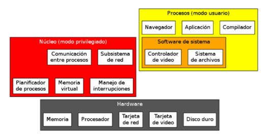

# 📘 Introducción

> Material de cursada de la materia **Sistemas Operativos**  
> 📅 Inicio: 09/04/2025  
> 🎓 Alumno: Tiago Pujia | 👨‍🏫 Prof: Alexis Villamayor  
> 🕔 Comisión 3900 [3 = Miercoles, 9 = Turno noche]
> ▶️ [Clases Grabadas](https://www.youtube.com/)

## Indice

- [📘 Introducción](#-introducción)
  - [Indice](#indice)
- [Clase 1](#clase-1)
  - [¿Que es un sistema operativo?](#que-es-un-sistema-operativo)
    - [¿Por qué estudiar los sistemas operatiovs?](#por-qué-estudiar-los-sistemas-operatiovs)
  - [Funciones y Objetivos](#funciones-y-objetivos)
    - [Inicialización (proceso de arranque)](#inicialización-proceso-de-arranque)
    - [Maquina Extendida (Interfaz)](#maquina-extendida-interfaz)
    - [Administración de recursos](#administración-de-recursos)
    - [Aislamiento](#aislamiento)
    - [Seguridad](#seguridad)
  - [Clasificaciones de Sistemas Operativos](#clasificaciones-de-sistemas-operativos)
    - [Segun la Cantidad de Usuarios](#segun-la-cantidad-de-usuarios)
    - [Segun la Cantidad de Procesadores que Soporta](#segun-la-cantidad-de-procesadores-que-soporta)
    - [Segun la Cantidad de Tareas que Sucesivas](#segun-la-cantidad-de-tareas-que-sucesivas)
    - [Segun sus Aplicaciones (Usos)](#segun-sus-aplicaciones-usos)
    - [Segun la Organización de su Arquitectura](#segun-la-organización-de-su-arquitectura)
  - [Interrupciones](#interrupciones)
    - [Definición](#definición)
    - [Clasificación](#clasificación)
      - [Segun prioridad](#segun-prioridad)
      - [Segun su origen](#segun-su-origen)
    - [Diferencia Interrupción y Excepción](#diferencia-interrupción-y-excepción)
    - [Funciones y Objetivos](#funciones-y-objetivos-1)
  - [Modos de Ejecucion de los Procesos](#modos-de-ejecucion-de-los-procesos)
  - [Definiciones Computo Distribuido](#definiciones-computo-distribuido)

# Clase 1

## ¿Que es un sistema operativo?

Definiciones dadas por el profesor sobre s.o:

> Conjunto de módulos o funciones (software), que, instalados en la computadora, se ocupan de controlar y administrar la ejecución de los programas sobre los recursos que brinda el equipo (hardware), tales como: memoria, procesador, periféricos, etc.

> Conjunto de programas que ordenadamente relacionados entre sí, contribuyen a que la computadora lleve a cabo correctamente su trabajo para nosotros en un ambiente dado.

El **kernel** es el núcleo del sistema operativo. Es la parte más importante, encargada de: administrar hardware,

### ¿Por qué estudiar los sistemas operatiovs?

No sólo en comprender los mecanismos de los mismos. Si no, entenderlos para evitar los errores más comunes al programar o aumentar la seguridad del sistema operativo.

## Funciones y Objetivos

El sistema operativo es el único programa que interactua directamente con el hardware. Sus funciones primarias son:

### Inicialización (proceso de arranque)

Al encender una computadora, se ejecuta un **chequeo inicial**, controlado por el firmware de la placa madre, ya sea **_BIOS_** o **_UEFI_**. Este proceso se encarga de inicializar y verificar el hardware esencial (como la memoria RAM, el procesador y los discos). Además, permite al usuario acceder a una interfaz de configuración, donde puede definir opciones como el orden de arranque.

Una vez completado este chequeo, el BIOS o UEFI busca un **dispositivo de almacenamiento** que contenga un **_MBR (Master Boot Record)_** válido. Este MBR se encuentra en el **primer sector físico del disco** (sector 0). En él se almacena una pequeña parte del **código de arranque**.

El BIOS transfiere el control al código ubicado en el MBR, el cual se encarga de identificar la **_partición activa_**, es decir, aquella que está marcada como booteable. Desde allí, el MBR accede al sector de arranque de dicha partición, donde se encuentra un puntero que lo dirige al **_gestor de arranque_** o **_bootloader_**.

El **_bootloader_** es un programa almacenado dentro del sistema de archivos del disco. Su función es **cargar el núcleo del sistema operativo (kernel)** en la **memoria RAM** y dar inicio a la ejecución del sistema, dejando el entorno preparado para que el usuario comience a trabajar.

### Maquina Extendida (Interfaz)

Procedimiento que permite la interacción del usuario con el ordenador. Sus principales funciones:

-   Facilita comunicación con el usuario
-   Aceptar entradas de nuevos trabajos
-   Abstracción: los programas no deben preocuparse de los detalles de acceso a hardware o de la configuración

Existen diferentes clasificación en las interfaces:

-   GUI (Grafica para Usuarios) -> KDE, Gnome, Aero
-   CLI (Linea de Comandos) -> Bash, cmd, powershell
-   NUI (Interfaz superior a la grafica) -> tactil, voz, gestos

### Administración de recursos

-   Mas del 70% del s.o esta dedicado a esta función
-   Gestiona politicas de asignación de recursos para que los programas no compitan por los ellos
-   Optimiza los recursos

### Aislamiento

En un sistema multiusuario y multitarea, cada proceso y cada usuario no tendra que preocuparse por otros que esten usando el mismo sistema.

### Seguridad

Garantizar la integridad de los recursos y procesos como, tambien validar los usuarios del sistema. Existen 2 modos para lograrlo:

-   Modo dual de ejecución del procesador - > separa en 2 tipos de instrucciones
    -   Modo usuario o no privilegiado
    -   Mood kernel o privilegiado (uso exclusivo para el s.o)
-   Juego de instrucciones diferenciadas del procesador

Si un usuario quiere usar instrucciones de kernel entra en un trap.

La seguridad se basa en 3 caracteristicas:

-   **Abstracción** -> Un usuario no puede escribir directo en el disco, su acceso debe estar limitado a la interfaz
-   **Administrar Recuersos** -> Politica de asignación de recursos
-   **Aislamiento** -> Si el S.O ofrece separación entre los datros, procesos y recursos de distintos usuarios. Ninguno debe tener acceso a la información del projimo.

## Clasificaciones de Sistemas Operativos

### Segun la Cantidad de Usuarios

-   **Monousuario** -> Un solo usuario
-   **Multiusuario** -> Varios usuarios (incluyendo remeto)

### Segun la Cantidad de Procesadores que Soporta

-   **Uniprocesador** -> Solo puede manejar un procesador de la computadora. Por lo que si tiene mas de un nucleo el cpu, es inutil.
-   **Multiprocesador** -> Sistemas capaces de manejar mas de un procesador

### Segun la Cantidad de Tareas que Sucesivas

-   **Monoprogramado o monotarea** -> Solo se puede ejecutar un proceso a la vez recien cuando finalize uno, arranca el siguiente.
-   **Multiprogramado(multitarea)** -> Mas de un proceso ejecutando el sistema

### Segun sus Aplicaciones (Usos)

-   **Proposito general** -> Propositos de amplia gama con cualquier fin
-   **Proposito especial** -> construccion a medida para un uso especifico. Se clasifica en:
    -   Tiempo real -> Tiempo de respuesta a eventos
        -   Tiempo Real No Crítico -> El tiempo de respuesta es importante, pero no vital
        -   Tiempo Real Crítico -> Requiere una respuesta inmediata
    -   Tolerante a fallas -> Se utilizan en aplicaciones donde es fundamental mantener un servicio continuo, incluso ante fallos de hardware o software. El mismo S.O detecta y corrige errores.
    -   Sistemas virtuales -> Los Sistemas Operativos Virtuales son capaces de administrar y gestionar otros sistemas operativos que se ejecutan de forma concurrente sobre el mismo hardware.

### Segun la Organización de su Arquitectura

Existen 2 formas principales de organización del núcleo de un sistema operativo, junto a un enfoque híbrido:

-   **Monoliticos**

Todo el sistema operativo corre como un único proceso privilegiado que opera como supervisor. Todas las funcionalidades (gestión de memoria, archivos, dispositivos, etc.) están integradas directamente en el núcleo.

Ventajas:

-   Simplifica gran cantidad de mecanismos -> mayor velocidad ejecución
-   Mayor flexibilidad

-   **MicroKernel**

El núcleo se mantiene en el minimo posible de funcionalidad, descargando en procesos especiales sin privilegios las tareas que implementan el acceso a dispositivos y las diversas politicas de uso del sistema. Se limita a las funciones más básicas (como planificación y comunicación).

Ventajas:

-   Esquema logico mas limpio
-   Implementaciones mas elegantes y faciles de comprender
-   Puede auto-repararse

-   **Hibridos**

Sistemas que son mayormente monolitocs pero que manejan algunos procesos que parecerian centrales mediante de procesos de nivel de usuario como microkernel.

La mayoría de los S.O. modernos, como Windows, adoptan este modelo por su equilibrio entre rendimiento y flexibilidad.

## Interrupciones

### Definición

Cuando ocurra algún evento que requiere la atención del sistema operativo, el mismo levanta la solicitud y detiene el proceso que estaba siendo ejecutado. El S.O ejecuta su rutina de manejo de interrupciones y atiende la interrupción. Las mismas se pueden organizar por orden de prioridad y hay un numero limitado.

### Clasificación

#### Segun prioridad

-   **No Enmascarable** -> Debe ser atentido si o si en el momento
-   **Enmascarable** -> No es urgente y se atiende cuando quiere

#### Segun su origen

-   **Software** -> llamadas del sistema (syscalls)
-   **Harware** -> llamadas por un componente fisico. Se subdivide en:
    -   Interno -> Dentro del procesador
    -   Externo -> Fuera del procesador

### Diferencia Interrupción y Excepción

-   **Interrupción** -> Causas externas a la computadora
-   **Excepción** -> Causado por un proceso interno

### Funciones y Objetivos

-   **Administrar el hawrdawre manejando interrupciones**
-   **Abstraer las Interrupciones** -> Oculta al programa de usuario que ocurren interrupociones de hardware. Pero, avisa al usuario mediante mensajes, señales o deteniendo el proceso.
-   **Atender Excepciones y Fallas** -> Durante la ejecución de un programa, ocurre situaciones anómales
-   **Punto de entrada al Sistema Operativo** -> Medio por el cual un proceso realiza una llamada al sistema (ecall de Assembly). Estas llamadas sirven para:
    -   **Control de Procesos** -> crear o finalizar proceso, asignar o liberar memoria, etc...
    -   **Manipular Archivos** -> Crear, borrar o renombrar un archivo
    -   **Manipulación de Dispositivos** -> Solicitar o liberar un dispositiovo
    -   **Manipular Información** -> Obtener o modificar la hora del sistema, pedir detalles acerca de procesos o archivos
    -   **Comunicaciones** -> Establecer una comunicación con determinado proceso (local o remoto)
    -   **Protección** -> Consultar o modificar la información relativa al acceso de objetos en el disco o sesión del usuario.

Las llamadas al sistema son expuestas al programador mediante las *interfaces de apliacación al programador*(API).

## Modos de Ejecucion de los Procesos

-   **Procesos Secuenciales** -> Cada proceso se ejecuta a continuación del otro
-   **Multiprogramación** -> Ilusion que se ejecutan varios procesos al mismo tiempo, pero en realidad esta alternando entre los diversos procesos que compiten por su atención. Por lo que, atiende simultaneamente diversos procesos.
-   **Multiprocesamiento** -> Entorno donde hay mas de un procesador (CPU). Por lo que diferentes procesos independientes se ejecutan en paralelo.
    -   **Asimétrico** -> Procesadores con arquitecturas distintas. Tambien se pueden llamar como coprocesaodres o procesadores coadyuvantes.
    -   **Simétrico** -> Todos los CPU son iguales y pueden realizar en el mismo tiempo las operaciones
        -   Unifrm Memory Access(UMA) -> Ambos procesadores comparten la memoria, utilizan un BUS compartido
        -   Non-Uniform Memory Access(NUMA) -> Cada procesador tiene bancos de memoria. Da como ventajas que es mas rapido.
-   **Hibrido** -> Multiprogramación y Multiprocesamiento se combinan. Las mayorias de PC funcionan asi.

## Definiciones Computo Distribuido

Proceso de cómputo realizado entre computadoras independientes, o tambien dicho, entre procesadores que no comparten memoria. Hay diferentes implementaciones:

-   **Cúmulos(Clusters)** -> Computadoras conectadas por una red local. La red es administrado por un software.
-   **Mallas (Grids)** -> Computadoras distribuidas a nivel geografico e interconectadas a una red.
-   **Cómputo En la Nube** -> Tercerización de servicios; la implementación de servicios deja de ser relevante. Se aplica conceptos como:
    -   Servicios Web
    -   Software como Servicio
    -   Plataforma como Servicio
    -   Infraestructura como Servicio
